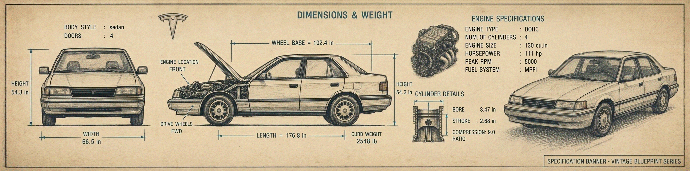

<p align="center">

</p>

# 🚗 Dataset Automobile: Especificaciones y Evaluación de Riesgo de Vehículos
## 1. 📖 Descripción General
El dataset "Automobile" es un conjunto de datos clásico y ampliamente utilizado en el campo del machine learning y el análisis de datos. Fue extraído del *Ward's Automotive Yearbook* de 1985 y donado al repositorio UCI en 1987. Este dataset contiene especificaciones técnicas detalladas de 205 vehículos de diferentes marcas y modelos, junto con información sobre su evaluación de riesgo de seguros y pérdidas normalizadas durante su uso.

El conjunto de datos es especialmente valioso para tareas de regresión (como predecir el precio de un automóvil) y clasificación (como evaluar su riesgo de seguro), y es ideal para ejercicios de limpieza de datos debido a la presencia de valores faltantes en atributos clave.

La versión utilizada en este análisis proviene del repositorio oficial de UCI Machine Learning Repository, una fuente confiable y ampliamente citada en investigaciones académicas y proyectos educativos.

## 2. 📊 Atributos y Significados
### 2.1 🔍 Variable Objetivo (Común)
**price** (Precio): Valor continuo que representa el precio de venta del vehículo en dólares.
- Rango: 5,118 – 45,400 USD
- Valores faltantes: Sí

**symboling** (Clasificación de riesgo): Indica el grado de riesgo del vehículo en términos de seguros, ajustado en relación con su precio.
- `-3`: Muy seguro
- `0`: Promedio
- `+3`: Muy riesgo
- Uso: Clasificación

**normalized-losses** (Pérdidas normalizadas): Representa el costo promedio de pérdida por vehículo asegurado en un año, normalizado por categoría de tamaño.
- Rango: 65 – 256
- Valores faltantes: Sí

### 2.2 🔧 Atributos Técnicos del Vehículo
**make** (Marca): Nombre del fabricante del automóvil.
- Ej: alfa-romero, audi, bmw, honda, toyota, volkswagen, etc.

**fuel-type** (Tipo de combustible): Tipo de combustible utilizado por el vehículo.
- `gas`: Gasolina
- `diesel`: Diésel

**aspiration** (Sistema de admisión):
- `std`: Normal (aspiración natural)
- `turbo`: Turboalimentado

**num-of-doors** (Número de puertas):
- `two`
- `four`

**body-style** (Estilo de carrocería):
- `sedan`, `hatchback`, `wagon`, `hardtop`, `convertible`

**drive-wheels** (Tracción):
- `fwd`: Delantera
- `rwd`: Trasera
- `4wd`: Cuatro ruedas

**engine-location** (Ubicación del motor):
- `front`: Delantero
- `rear`: Trasero

### 2.3 📏 Dimensiones y Peso
**wheel-base** (Distancia entre ejes): Distancia entre las ruedas delanteras y traseras (pulgadas).
- Rango: 86.6 – 120.9

**length** (Longitud): Longitud total del vehículo (pulgadas).
- Rango: 141.1 – 208.1

**width** (Anchura): Ancho del vehículo (pulgadas).
- Rango: 60.3 – 72.3

**height** (Altura): Altura del vehículo (pulgadas).
- Rango: 47.8 – 59.8

**curb-weight** (Peso en vacío): Peso del vehículo sin carga (libras).
- Rango: 1,488 – 4,066

### 2.4 ⚙️ Motor y Rendimiento
**engine-type** (Tipo de motor):
- `ohc`, `ohcf`, `dohc`, `rotor`, etc.

**num-of-cylinders** (Número de cilindros):
- `four`, `six`, `five`, `eight`, `twelve`, etc.

**engine-size** (Tamaño del motor): Desplazamiento del motor (pulgadas cúbicas).
- Rango: 61 – 326

**fuel-system** (Sistema de inyección/combustible):
- `mpfi`, `2bbl`, `mfi`, `idi`, etc.

**bore** (Diámetro del cilindro): Diámetro interno del cilindro (pulgadas).
- Rango: 2.54 – 3.94
- Valores faltantes: Sí

**stroke** (Carrera del pistón): Distancia que recorre el pistón (pulgadas).
- Rango: 2.07 – 4.17
- Valores faltantes: Sí

**compression-ratio** (Relación de compresión):
- Rango: 7 – 23

**horsepower** (Potencia): Caballos de fuerza del motor.
- Rango: 48 – 288
- Valores faltantes: Sí

**peak-rpm** (RPM máximos): Revoluciones por minuto máximas.
- Rango: 4,150 – 6,600
- Valores faltantes: Sí

### 2.5 ⛽ Eficiencia de Combustible
**city-mpg** (Consumo urbano): Millas por galón en ciudad.
- Rango: 13 – 49

**highway-mpg** (Consumo carretera): Millas por galón en autopista.
- Rango: 16 – 54

### 2.6 🏷️ Atributos Identificativos
No hay un ID explícito, pero la combinación de `make`, `model` (implícito), `year` y atributos técnicos permite identificar cada vehículo.

## 3. 🏢 Origen y Procedencia
### 3.1 📚 Fuente Primaria: UCI Machine Learning Repository
El dataset fue obtenido del repositorio oficial:
- **URL**: https://archive.ics.uci.edu/dataset/10/automobile
- **ID del dataset**: 10
- **Donado por**: Jeffrey Schlimmer (1987)

### 3.2 🏛️ Fuentes Históricas Originales
Los datos originales provienen del *Ward's Automotive Yearbook* de 1985, una publicación de referencia en la industria automotriz que recopila especificaciones técnicas y comerciales de vehículos nuevos.

## 4. 🔄 Proceso de Curaduría
El repositorio UCI ha realizado una curaduría básica del dataset original, incluyendo:
- Estandarización de formatos
- Documentación detallada de atributos
- Identificación de valores faltantes
- Disponibilidad pública bajo licencia abierta

## 5. 🎯 Valor Analítico
Este dataset presenta características ideales para el aprendizaje y la investigación:
- Tamaño manejable (205 instancias, 25 atributos)
- Mezcla de tipos de datos: categóricos, enteros y reales
- Valores faltantes en múltiples variables (ideal para imputación)
- Tareas múltiples: regresión (precio), clasificación (symboling), clustering
- Contexto técnico real y bien documentado

## 6. 📝 Consideraciones Éticas
Aunque este dataset no contiene información personal sensible, es importante tratar los datos con rigor técnico y reconocer su origen en informes actuarial y de seguros. Su uso debe promover prácticas justas en modelos predictivos, especialmente cuando se aplican a evaluaciones de riesgo.

## 7. 🔗 Acceso y Uso
El dataset está disponible públicamente bajo una licencia **Creative Commons Attribution 4.0 International (CC BY 4.0)**, lo que permite su uso, modificación y distribución, siempre que se dé el crédito adecuado.

### 7.1 📥 Cómo cargarlo en Python:

Acceso vía UCI:
```python
from ucimlrepo import fetch_ucirepo

# fetch dataset 
automobile_ds = fetch_ucirepo(id=10)

data (as pandas dataframes) 
X = automobile_ds.data.features
y = automobile_ds.data.targets

# metadata 
print(automobile_ds.metadata) 
  
# variable information 
print(automobile_ds.variables) 
```

Acceso vía repositorio GitHub:
```python
import pandas as pd

# url del repositorio github para descargar
url = "https://raw.githubusercontent.com/rna-univ/datasets/main/automobile/automobile.csv"
automobile_ds = pd.read_csv(url)

# Separar características y etiquetas
# Otros atributos objetivos: Price, Symboling, Normalized-losses
X = automobile_ds.drop(columns=['price'])
y = automobile_ds['price']

# Información del dataset
print("Columnas:", automobile_ds.columns.tolist())
print("Primeras filas:\n", automobile_ds.head())
```
## 8. 🔖 Cita Recomendada:
>Schlimmer, J. (1985). Automobile Dataset. UCI Machine Learning Repository. https://doi.org/10.24432/C5B01C

---
*Última actualización: Abril 2025*
*Mantenido por la comunidad de ciencia de datos para propósitos educativos y de investigación.*