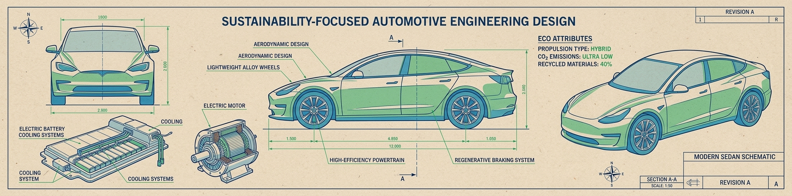

<p align="center">

</p>

# 🚗 Dataset Automóviles Simple: Predicción de Precios y Evaluación Ecológica
## 📖 Descripción General
El conjunto de datos "Automobile-Simple" es una versión adaptada y simplificada del dataset clásico de Automóviles, diseñado específicamente para fines educativos en machine learning. Esta versión conserva las variables más relevantes del dataset original mientras agrega atributos derivados que reflejan conceptos técnicos y ecológicos integrados.

El dataset contiene especificaciones técnicas esenciales de 205 vehículos de diferentes marcas y modelos, junto con información sobre precios y una nueva métrica de evaluación ecológica. Es ideal para ejercicios de regresión (predicción de precios) y clasificación (evaluación ecológica), con un enfoque en la simplicidad y la interpretabilidad de los modelos.

## 📊 Atributos y Significados

### 🔍 Variables Objetivo
**price** (Precio): Valor continuo que representa el precio de venta del vehículo en dólares.
- Rango: 5,118 – 45,400 USD
- Valores faltantes: Sí (algunos registros)

**eco-rating** (Evaluación Ecológica): Puntuación continua que representa la eficiencia ecológica del vehículo, calculada a partir de múltiples factores de rendimiento y consumo.
- Rango: 15.50 – 83.09
- Valores faltantes: No

### 🏭 Atributos Básicos del Vehículo
**make** (Marca): Fabricante del automóvil.
- Ej: alfa-romero, audi, bmw, chevrolet, toyota, volkswagen, etc.

**fuel-type** (Tipo de combustible): Tipo de combustible utilizado.
- `gas`: Gasolina
- `diesel`: Diésel

**num-of-doors** (Número de puertas):
- `two`: Dos puertas
- `four`: Cuatro puertas
- Valores faltantes: Sí (algunos registros)

**body-style** (Estilo de carrocería):
- `sedan`, `hatchback`, `wagon`, `convertible`, `hardtop`

### ⚖️ Dimensiones y Peso
**curb-weight** (Peso en vacío): Peso del vehículo sin carga (libras).
- Rango: 1,488 – 4,066

**volume** (Volumen): Atributo derivado que representa el volumen aproximado del vehículo, calculado a partir de dimensiones físicas.
- Rango: 452,643.16 – 846,007.66
- Unidades: unidades cúbicas adimensionales

### ⚙️ Motor y Rendimiento
**engine-size** (Tamaño del motor): Desplazamiento del motor (pulgadas cúbicas).
- Rango: 61 – 326

**horsepower** (Potencia): Caballos de fuerza del motor.
- Rango: 48 – 288
- Valores faltantes: Sí (algunos registros)

### ⛽ Eficiencia de Combustible
**city-mpg** (Consumo urbano): Millas por galón en ciudad.
- Rango: 13 – 49

**highway-mpg** (Consumo carretera): Millas por galón en autopista.
- Rango: 16 – 54

### 🌱 Atributo Ecológico Derivado
**eco-rating** (Evaluación Ecológica): Puntuación compuesta que integra:
- Eficiencia de combustible (city-mpg, highway-mpg)
- Emisiones relativas (basado en fuel-type)
- Eficiencia energética (relación potencia/consumo)
- Factor de tamaño (volumen/peso)

## 🏢 Origen y Procedencia

### 📚 Adaptación del Dataset Original
Esta versión simplificada se basa en el dataset original de Automóviles del UCI Machine Learning Repository, pero ha sido adaptada para:
- Reducir la dimensionalidad (de 25+ a 11 atributos)
- Agregar métricas derivadas con significado conceptual
- Facilitar el aprendizaje para principiantes
- Incluir una variable objetivo ecológica relevante

### 🔗 Ubicación Actual
El dataset está disponible en el repositorio GitHub de datasets educativos:
> **URL**: https://github.com/rna-univ/datasets/tree/main/automobile
>
> **Archivo**: automobile-simple.csv

## 🔄 Proceso de Adaptación
La versión simplificada fue creada mediante:
- Selección de atributos más relevantes del dataset original
- Cálculo de atributos derivados (volume, eco-rating)
- Limpieza básica y estandarización de formatos
- Documentación orientada a aplicaciones educativas

## 🎯 Valor Analítico
Este dataset ofrece oportunidades ideales para el aprendizaje:
- **Regresión**: Predicción de precios de vehículos
- **Clasificación**: Categorización por eficiencia ecológica
- **Análisis exploratorio**: Relaciones entre especificaciones técnicas y precio
- **Feature engineering**: Entendimiento de atributos derivados
- **Visualización**: Multidimensional de datos técnicos
- **Interpretabilidad**: Modelos con variables de significado claro

## 📝 Consideraciones Técnicas
- **Valores faltantes**: Algunos registros tienen valores missing en `price`, `num-of-doors` y `horsepower`
- **Atributos derivados**: `volume` y `eco-rating` son cálculos basados en múltiples variables originales
- **Contexto temporal**: Los datos reflejan tecnología automotriz de 1985
- **Uso educativo**: Ideal para enseñar preprocesamiento y modelado básico

## 🔗 Acceso y Uso
El dataset está disponible para uso educativo sin restricciones.

### 📥 Cómo cargarlo en Python:

Acceso con el DataLoader de la biblioteca `rna` (Recomendado):
```python
# Instalar la biblioteca si no está disponible:
# !pip install https://github.com/RNA-UNIV/rna/archive/refs/heads/main.zip

from rna.data.ClassDataLoader import DataLoader

# Cargar el dataset como DataFrame de Pandas
df = DataLoader.load_dataframe('automobile_simple')
```

```python
import pandas as pd

# URL del archivo en GitHub
url = "https://raw.githubusercontent.com/rna-univ/datasets/main/automobile/automobile-simple.csv"
auto_simple_ds = pd.read_csv(url)

# Información del dataset
print("Columnas:", auto_simple_ds.columns.tolist())
print("\nPrimeras filas:")
print(auto_simple_ds.head())
print("\nValores faltantes por columna:")
print(auto_simple_ds.isnull().sum())

# Para predicción de precios
X_price = auto_simple_ds.drop(columns=['price'])
y_price = auto_simple_ds['price']

# Para clasificación ecológica (ejemplo: categorizar por percentiles)
auto_simple_ds['eco_category'] = pd.qcut(auto_simple_ds['eco-rating'], q=4, labels=['Bajo', 'Medio', 'Alto', 'Muy Alto'])
X_eco = auto_simple_ds.drop(columns=['eco_category', 'eco-rating'])
y_eco = auto_simple_ds['eco_category']
```

## 🔖 Cita Recomendada:

Dataset Original:
> Schlimmer, J. (1985). Automobile Dataset. UCI Machine Learning Repository.
    https://doi.org/10.24432/C5B01C

Versión simplificada: 
> Universidad Nacional de La Plata. (2022).
    https://github.com/rna-univ/datasets/tree/main/automobile

---

*Última actualización: Diciembre 2022
Mantenido por la comunidad de ciencia de datos para propósitos educativos.*