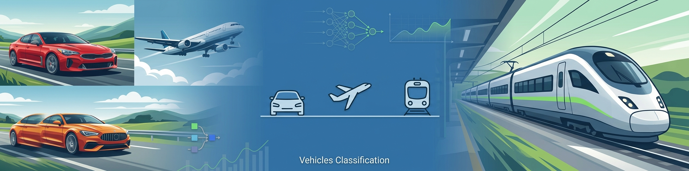

<p align="center">

</p>

# 🚗✈️🚆 Dataset Cars, Planes and Trains

## 1. 📖 Descripción General

El dataset **Cars, Planes and Trains** es un conjunto de imágenes destinado a tareas de **clasificación multiclase** mediante aprendizaje automático y aprendizaje profundo.

El conjunto contiene imágenes de tres categorías de vehículos:

- `car`: automóviles
- `plane`: aviones
- `train`: trenes

Cada clase contiene **400 imágenes**, para un total de **1.200 imágenes**. Las imágenes presentan **resoluciones variadas**, por lo que normalmente deben redimensionarse a una resolución común antes de utilizarlas para entrenar una red neuronal convolucional.

Por su tamaño reducido y la separación clara de las clases, es un dataset apropiado para prácticas de clasificación de imágenes, redes neuronales convolucionales (CNN), transferencia de aprendizaje y experimentación con diferentes técnicas de preprocesamiento.

## 2. 📊 Estructura del Dataset

### 2.1 🎯 Variable Objetivo

**Tipo de vehículo:** categoría correspondiente a la imagen.

| Clase | Descripción | Imágenes |
|---|---|---:|
| `car` | Automóviles | 400 |
| `plane` | Aviones | 400 |
| `train` | Trenes | 400 |
| **Total** | | **1.200** |

El dataset está perfectamente balanceado en cantidad de imágenes entre las tres clases.

### 2.2 🖼️ Características de las Imágenes

- **Tipo de dato**: imagen
- **Canales**: no especificados en la descripción original
- **Resolución**: variable
- **Cantidad total**: 1.200 imágenes
- **Clases**: 3
- **Distribución**: 400 imágenes por clase

La resolución variable es un aspecto importante del dataset: para utilizarlo con modelos que requieren una entrada de tamaño fijo, como CNN preentrenadas, es necesario aplicar un redimensionamiento durante la carga o el preprocesamiento.

### 2.3 📁 Estructura de Carpetas

La organización esperada es una carpeta por clase:

```text
cars_planes_trains/
├── car/
├── plane/
└── train/
```

Cada carpeta contiene las imágenes correspondientes a su clase.

### 2.4 📈 Distribución de Instancias

| Clase | Imágenes | Porcentaje |
|---|---:|---:|
| `car` | 400 | 33,3 % |
| `plane` | 400 | 33,3 % |
| `train` | 400 | 33,3 % |
| **Total** | **1.200** | **100 %** |

No se proporciona una división predefinida entre entrenamiento, validación y prueba. Para experimentos supervisados, estos subconjuntos deben generarse a partir del conjunto completo, procurando mantener la proporción entre clases.

## 3. 🏢 Origen y Procedencia

### 3.1 📚 Fuente Primaria

El dataset original fue publicado en **Kaggle** por **Maciej Gronczynski** bajo el título *Vehicle Classification - Dataset*.

La descripción original indica que contiene tres clases (`car`, `plane`, `train`) con 400 imágenes por clase y resoluciones variadas.

### 3.2 📜 Licencia

El dataset está publicado en Kaggle bajo la licencia **CC0: Public Domain**. Esto permite su reutilización, modificación y redistribución sin las restricciones habituales de copyright, de acuerdo con los términos de CC0.

## 4. 🔄 Proceso de Curaduría

Para la versión `cars_planes_trains` del repositorio se mantiene la clasificación original del dataset:

- Se conservan las **tres clases originales**.
- Se mantienen las **400 imágenes de cada clase**.
- Se conserva la cantidad total de **1.200 imágenes**.
- No se establece una resolución única, ya que el dataset original contiene imágenes de **resoluciones variadas**.
- La estructura por carpetas permite utilizar directamente herramientas como `tf.keras.utils.image_dataset_from_directory`, `ImageFolder` de PyTorch y el `DataLoader` del repositorio.

No se realiza una división artificial en `train`, `validation` y `test` dentro del dataset. La división puede realizarse durante el experimento para evitar duplicar los datos.

## 5. 🎯 Valor Analítico

Este dataset presenta características especialmente útiles para prácticas de visión por computadora:

- **Tamaño pequeño**: 1.200 imágenes, adecuado para experimentación rápida.
- **Tres clases balanceadas**: evita problemas de desbalance entre categorías.
- **Clasificación multiclase**: permite trabajar con softmax y funciones de pérdida como `categorical_crossentropy` o `sparse_categorical_crossentropy`.
- **Resoluciones variadas**: permite introducir conceptos de normalización y redimensionamiento de imágenes.
- **Clases visualmente diferenciadas**: facilita la experimentación inicial con CNN.
- **Transfer Learning**: su tamaño reducido hace especialmente interesante utilizar modelos preentrenados como MobileNetV2, ResNet50 o EfficientNet.
- **Data Augmentation**: permite estudiar el efecto de rotaciones, traslaciones, zoom y volteos sobre la generalización.

Debido a su tamaño, no debe considerarse un benchmark de visión por computadora de gran escala. Es más apropiado para **fines educativos, prototipado y comparación de arquitecturas**.

## 6. 📝 Consideraciones Éticas

El dataset está compuesto por imágenes de vehículos y no se describe información personal asociada a las imágenes. No obstante, al redistribuir o utilizar imágenes provenientes de terceros, es recomendable conservar la referencia al dataset original y verificar las condiciones de uso aplicables a cada imagen.

La licencia publicada para el dataset en Kaggle es **CC0: Public Domain**.

## 7. 🔗 Acceso y Uso

El dataset original está disponible públicamente en Kaggle.

### 7.1 📥 Cómo cargarlo en Python

#### Acceso con el DataLoader de la biblioteca `rna`

```python
from rna.data import DataLoader

# Cargar las imágenes redimensionándolas a un tamaño común
X, y, class_names = DataLoader.load_images(
    "cars_planes_trains",
    resize=(224, 224)
)

print("Forma de X:", X.shape)
print("Clases:", class_names)
```

#### Acceso directo con TensorFlow / Keras

```python
import tensorflow as tf

ds = tf.keras.utils.image_dataset_from_directory(
    "cars_planes_trains",
    image_size=(224, 224),
    batch_size=32,
    shuffle=True
)

print("Clases:", ds.class_names)
```


## 8. 🔖 Cita Recomendada

> Gronczynski, M. *Vehicle Classification - Dataset*. Kaggle.

Fuente original: Kaggle, dataset `maciejgronczynski/vehicle-classification-dataset`.

---
*Última actualización: Agosto 2026*  
*Mantenido por la comunidad de ciencia de datos para propósitos educativos y de investigación.*
