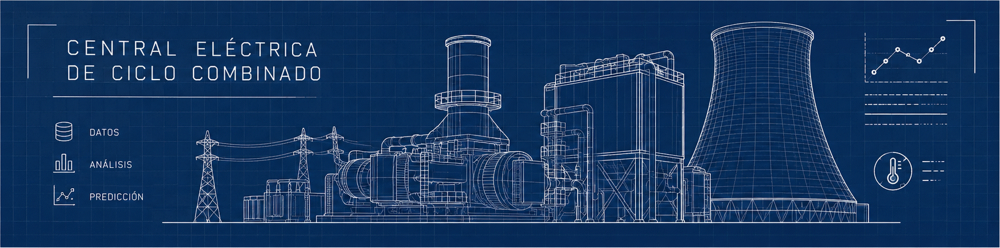

<p align="center">

</p>

# ⚡ Dataset CCPP: Predicción de Producción de Energía en Planta de Ciclo Combinado

## 1. 📖 Descripción General

El **CCPP Dataset** (Combined Cycle Power Plant) es uno de los conjuntos de datos más utilizados en el ámbito del aprendizaje automático aplicado a sistemas de energía. Fue recopilado por **Pınar Tüfekci** (Universidad Namık Kemal, Turquía) y **Heysem Kaya** (Universidad de Boğaziçi, Turquía) a lo largo de seis años, y publicado formalmente en 2014 en el artículo *"Prediction of full load electrical power output of a base load operated combined cycle power plant using machine learning methods"*.

La versión estándar proviene del **repositorio de Machine Learning de la Universidad de California, Irvine (UCI)**, siendo un benchmark ampliamente adoptado para problemas de regresión. El dataset contiene mediciones ambientales horarias registradas durante la operación a plena carga de una planta de ciclo combinado, con el objetivo de predecir la producción neta de energía eléctrica.

Una planta de ciclo combinado (CCPP) está compuesta por:

- **Turbinas de gas (GT)**
- **Turbinas de vapor (ST)**
- **Generadores de vapor por recuperación de calor (HRSG)**

Lo que hace a este dataset tan valioso es su **relevancia industrial y su estructura limpia**: con 4 variables ambientales continuas y un único objetivo de regresión, permite introducir conceptos de predicción, análisis de correlación y optimización energética de forma directa y aplicada.

## 2. 📊 Atributos y Significados

### 2.1 🎯 Variable Objetivo

**PE (Net Hourly Electrical Energy Output)**: Producción neta de energía eléctrica horaria de la planta.  
- Rango observado: 420.26 – 495.76 MW  
- *Valor numérico continuo, expresado en megawatts (MW).*

### 2.2 📏 Atributos de Entrada (variables ambientales horarias promedio)

**AT (Ambient Temperature / Temperatura Ambiente)**: Temperatura ambiente registrada alrededor de la planta.  
- Rango observado: 1.81 – 37.11 °C  
- *Afecta principalmente el rendimiento de la turbina de gas.*

**AP (Ambient Pressure / Presión Ambiente)**: Presión atmosférica registrada en el entorno de la planta.  
- Rango observado: 992.89 – 1033.30 mbar  
- *Afecta principalmente el rendimiento de la turbina de gas.*

**RH (Relative Humidity / Humedad Relativa)**: Humedad relativa del ambiente.  
- Rango observado: 25.56 – 100.16 %  
- *Afecta principalmente el rendimiento de la turbina de gas.*

**V (Exhaust Vacuum / Vacío de Escape)**: Nivel de vacío en el condensador de la turbina de vapor.  
- Rango observado: 25.36 – 81.56 cm Hg  
- *Afecta exclusivamente el rendimiento de la turbina de vapor.*

## 3. 🏢 Origen y Procedencia

### 3.1 📚 Fuente Primaria: UCI Machine Learning Repository

El dataset fue obtenido del repositorio oficial de la Universidad de California, Irvine, donde se encuentra disponible como recurso de referencia para tareas de regresión.

> **URL Oficial**: 👉 `https://archive.ics.uci.edu/dataset/294/combined+cycle+power+plant`
>
> **Nombre del dataset**: `combined+cycle+power+plant`  
> **ID UCI**: `294`

### 3.2 📜 Contexto Histórico

Los datos fueron recolectados entre **2006 y 2011** mediante sensores distribuidos alrededor de una planta real de ciclo combinado en operación. Los valores de cada variable corresponden a **promedios horarios** calculados a partir de mediciones por segundo. La planta operó en todo momento bajo condiciones de **plena carga**, lo que garantiza consistencia operativa en las observaciones.

## 4. 🔁 Proceso de Curaduría

El dataset ha sido meticulosamente curado y verificado:

- 9568 instancias completas (mediciones horarias durante 6 años)
- Sin valores faltantes
- Variables sin normalización (valores en unidades físicas reales)
- Datos disponibles en formato `.xlsx` y `.ods`
- 5 permutaciones aleatorias (shuffles) incluidas para validación cruzada 5×2

## 4.1 ⚠️ Implementación en esta Biblioteca

La implementación actual utiliza únicamente la primera primera permutación del archivo original.

Esta hoja contiene las 9568 observaciones completas del dataset y representa la versión habitualmente utilizada en ejemplos académicos, tutoriales y benchmarks de regresión.

Las restantes permutaciones no se incluyen en esta implementación, ya que contienen los mismos registros y atributos reorganizados mediante diferentes permutaciones aleatorias.

## 5. 🎯 Valor Analítico

Este dataset ofrece un entorno analítico ideal para:

- **Regresión supervisada** (predicción de salida energética continua)
- **Análisis de correlación** entre variables ambientales y producción
- **Pruebas de algoritmos** de machine learning de regresión (SVR, RF, redes neuronales)
- **Benchmarking** con validación cruzada 5×2 (protocolo estándar del paper original)
- **Enseñanza de conceptos** de sobreajuste, regularización y evaluación de modelos
- **Visualización** con scatter plots, heatmaps de correlación y análisis de residuos

Su tamaño moderado (9568 instancias, 4 atributos de entrada) y sus relaciones no lineales lo convierten en un recurso ideal para proyectos educativos y benchmarking de algoritmos de regresión.

## 6. 📝 Consideraciones Éticas

Si bien el dataset no presenta problemas éticos significativos al tratarse de mediciones físicas industriales, es importante:

- Reconocer el trabajo original de Tüfekci y Kaya
- Utilizar el dataset con fines educativos y de investigación
- Citar apropiadamente las fuentes originales
- Tener en cuenta que los datos provienen de una única planta bajo condiciones específicas, por lo que la generalización a otras instalaciones requiere validación adicional

## 7. 🔗 Acceso y Uso

El dataset está disponible de forma **pública** a través del repositorio UCI y múltiples librerías de Python.

### 7.1 📥 Cómo cargarlo en Python:

Acceso con el DataLoader de la biblioteca `rna` (Recomendado):
```python
# Instalar la biblioteca si no está disponible:
# !pip install https://github.com/RNA-UNIV/rna/archive/refs/heads/main.zip

from rna.data.ClassDataLoader import DataLoader

# Cargar el dataset como DataFrame de Pandas
df = DataLoader.load_dataframe('ccpp')
```

Acceso con UCI:
```python
from ucimlrepo import fetch_ucirepo

# Cargar dataset
ccpp = fetch_ucirepo(id=294)

# data (como dataframes pandas)
X = ccpp.data.features
y = ccpp.data.targets

# metadata
print(ccpp.metadata)

# información del dataset
print(ccpp.variables)
```

Acceso directo desde el repositorio UCI (archivo Excel):
```python
import pandas as pd

# Descargar y leer el archivo Excel desde UCI
url = "https://archive.ics.uci.edu/ml/machine-learning-databases/00294/CCPP.zip"

# Alternativamente, si ya se descargó el ZIP y se extrajo:
df = pd.read_excel("CCPP/Folds5x2_pp.xlsx")

# Separar características y etiqueta
X = df[['AT', 'V', 'AP', 'RH']]
y = df['PE']

# Información del dataset
print("Columnas:", df.columns.tolist())
print("Forma de los datos:", df.shape)
print("Primeras filas:\n", df.head())
```

Acceso vía repositorio GitHub:
```python
import pandas as pd

# url del repositorio github para descargar
url = "https://raw.githubusercontent.com/rna-univ/datasets/main/ccpp/ccpp.csv"
ccpp = pd.read_csv(url)

# Separar características y etiqueta
X = ccpp.drop(columns=['PE'])
y = ccpp['PE']

# Información del dataset
print("Columnas:", ccpp.columns.tolist())
print("Primeras filas:\n", ccpp.head())
```

## 8. 🔖 Citas Recomendadas:

> Tüfekci, P. (2014). *Prediction of full load electrical power output of a base load operated combined cycle power plant using machine learning methods*. International Journal of Electrical Power & Energy Systems, 60, 126–140. https://doi.org/10.1016/j.ijepes.2014.02.027

> Kaya, H., Tüfekci, P., & Gürgen, S. F. (2012). *Local and Global Learning Methods for Predicting Power of a Combined Gas & Steam Turbine*. Proceedings of the International Conference on Emerging Trends in Computer and Electronics Engineering ICETCEE 2012, pp. 13–18. Dubai.