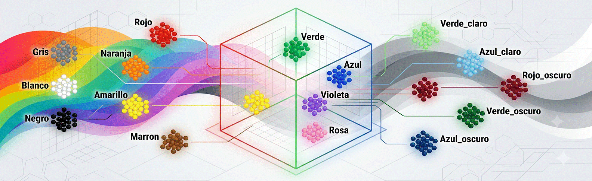

<p align="center">

</p>

# 🎨 Dataset Colores RGB 16: Clasificación de Color a partir de Valores RGB

## 1. 📖 Descripción General
El dataset "Colores RGB 16" es un conjunto de datos **sintético** diseñado con fines educativos para tareas de clasificación de color a partir de sus componentes RGB. Cada muestra representa un color definido por sus tres canales (Rojo, Verde, Azul) junto con la categoría de color a la que pertenece, elegida entre 16 clases (incluyendo tonos puros, variantes claras/oscuras, y acromáticos).

A diferencia de un dataset RGB generado por muestreo uniforme del cubo de color, este conjunto fue construido definiendo cada categoría como una región en el espacio **HSV** (matiz, saturación, valor) y convirtiendo luego a RGB. Este enfoque evita el solapamiento arbitrario entre clases vecinas (por ejemplo, Azul vs. Azul_claro) y produce fronteras de decisión consistentes con la percepción humana del color.

El dataset es ideal para introducir conceptos de clasificación multiclase, ingeniería de atributos (features derivadas de RGB/HSV) y evaluación de modelos con clases desbalanceadas o de dificultad dispar, sin los problemas de calidad de datos típicos de un dataset real (no tiene valores faltantes ni ruido de etiquetado).

## 2. 📊 Atributos y Significados
### 2.1 🔍 Variable Objetivo
**Color** (Categoría de color): Etiqueta categórica con 16 valores posibles.
- Tonos puros: `Rojo`, `Naranja`, `Amarillo`, `Verde`, `Azul`, `Violeta`, `Rosa`
- Variantes oscuras: `Rojo_oscuro`, `Verde_oscuro`, `Azul_oscuro`
- Variantes claras: `Verde_claro`, `Azul_claro`
- Otros: `Marron`
- Acromáticos: `Gris`, `Blanco`, `Negro`
- Valores faltantes: No

### 2.2 🎨 Componentes de Color (RGB)
**R** (Rojo): Componente rojo del color.
- Rango: 0 – 255

**G** (Verde): Componente verde del color.
- Rango: 0 – 255

**B** (Azul): Componente azul del color.
- Rango: 0 – 255

### 2.3 🧮 Atributos Derivados
Estos atributos no forman parte del dataset base, pero pueden calcularse fácilmente a partir de R, G, B:

**Saturacion**: Diferencia relativa entre el canal máximo y mínimo, normalizada por el máximo.
- Rango: 0.0 – 1.0

**Luminosidad**: Promedio simple de los tres canales.
- Rango: 0 – 255

**Contraste**: Diferencia entre el canal máximo y el mínimo (delta).
- Rango: 0 – 255

**Prop_R, Prop_G, Prop_B**: Proporción de cada canal respecto de la suma total (R+G+B).
- Rango: 0.0 – 1.0 (suman 1 entre las tres)

**Diff_RG, Diff_GB, Diff_BR**: Diferencias directas entre pares de canales.
- Rango: -255 – 255

### 2.4 🏷️ Atributos Identificativos
No hay un ID explícito. Cada fila corresponde a una muestra de color generada independientemente; no existen claves naturales ni duplicados (se eliminan duplicados exactos de RGB durante la generación).

## 3. 🏢 Origen y Procedencia
### 3.1 🧪 Generación Sintética
A diferencia de los demás datasets del repositorio, este conjunto no proviene de una fuente externa: fue generado programáticamente para el proyecto RNA-UNIV con el objetivo de contar con un dataset de clasificación simple, controlado y libre de ambigüedad de etiquetado, útil para prácticas introductorias de ML.

Cada una de las 16 categorías se define mediante rangos de matiz (H), saturación (S) y valor (V) en el espacio HSV. Para cada categoría se samplean valores aleatorios uniformes dentro de su rango, y se convierten a RGB mediante `colorsys.hsv_to_rgb`.

### 3.2 🔁 Reproducibilidad
La generación utiliza semillas fijas (`random.seed(42)`, `np.random.seed(42)`), lo que garantiza la reproducibilidad del proceso.

## 4. 🔄 Proceso de Curaduría
La construcción del dataset incluyó las siguientes decisiones de diseño, adoptadas tras iterar sobre una versión previa basada en rangos RGB (que presentaba ambigüedad de etiquetado en las fronteras):
- Definición de categorías en espacio HSV en lugar de RGB, para separar tono de variante clara/oscura de forma consistente con la percepción humana.
- Reglas de etiquetado **determinísticas**: cada categoría corresponde a una región fija del espacio HSV, sin asignación probabilística en zonas de frontera.
- Eliminación de duplicados exactos de RGB (`drop_duplicates`), conservando la primera ocurrencia.
- Selección del tamaño muestral (`n_por_color=75`, ~1200 muestras totales) mediante un análisis de curva de aprendizaje con validación cruzada (5-fold), confirmando que el desempeño del modelo se estabiliza (~98-99% de precisión) desde tamaños muestrales relativamente bajos, dado que las clases son separables por diseño.

## 5. 🎯 Valor Analítico
Este dataset presenta características ideales para el aprendizaje introductorio de ML:
- Tamaño manejable (~1,200 instancias, 3 atributos base + 9 derivados opcionales)
- Sin valores faltantes ni inconsistencias de etiquetado
- Clasificación multiclase con 16 clases, incluyendo pares de dificultad intencional (ej. Azul vs. Azul_claro, Verde vs. Verde_claro) útiles para ilustrar matrices de confusión y métricas por clase
- Punto de partida simple para practicar ingeniería de atributos (comparar desempeño con y sin features derivadas)
- Generación reproducible mediante semillas fijas, lo que facilita crear variantes controladas (más clases, rangos más solapados, distinto tamaño muestral) para fines comparativos

## 6. 📝 Consideraciones Éticas
Al tratarse de un dataset sintético sin datos personales ni sensibles, no presenta riesgos éticos relevantes. Una limitación a señalar con fines pedagógicos: los nombres de color y sus rangos HSV reflejan una convención de categorización particular (la del equipo que construyó el dataset), no un estándar universal de nomenclatura de colores; distintas culturas o convenciones podrían delimitar estas categorías de forma diferente.

## 7. 🔗 Acceso y Uso
El dataset está disponible públicamente bajo una licencia **Creative Commons Attribution 4.0 International (CC BY 4.0)**, lo que permite su uso, modificación y distribución, siempre que se dé el crédito adecuado.

### 7.1 📥 Cómo cargarlo en Python:

Acceso con el DataLoader de la biblioteca `rna` (Recomendado):
```python
# Instalar la biblioteca si no está disponible:
# !pip install https://github.com/RNA-UNIV/rna/archive/refs/heads/main.zip

from rna.data.ClassDataLoader import DataLoader

# Cargar el dataset como DataFrame de Pandas
df = DataLoader.load_dataframe('colores_rgb_16')
```

Acceso vía repositorio GitHub:
```python
import pandas as pd

# url del repositorio github para descargar
url = "https://raw.githubusercontent.com/rna-univ/datasets/main/colores_rgb_16/colores_rgb_16.csv"
colores_ds = pd.read_csv(url)

# Separar características y etiqueta
X = colores_ds.drop(columns=['Color'])
y = colores_ds['Color']

# Información del dataset
print("Columnas:", colores_ds.columns.tolist())
print("Primeras filas:\n", colores_ds.head())
```

## 8. 🔖 Cita Recomendada:
> RNA-UNIV (2026). Dataset Colores RGB 16 (versión sintética). Repositorio de datasets RNA-UNIV. https://github.com/rna-univ/datasets

---
*Última actualización: Julio 2026*
*Mantenido por la comunidad de ciencia de datos para propósitos educativos y de investigación.*