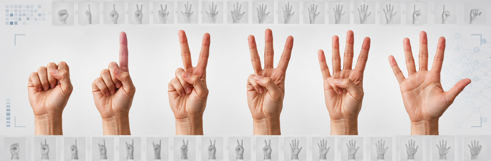

<p align="center">

</p>

# ✋ Dataset de Dedos: Clasificación de Número de Dedos en Imágenes de Manos

## 1. 📖 Descripción General

**Fingers Dataset** es un conjunto de datos diseñado para la clasificación del número de dedos mostrados en imágenes de manos, basándose en características visuales extraídas de fotografías en escala de grises. Este dataset es ampliamente utilizado en estudios de visión por computadora, clasificación de imágenes y redes neuronales convolucionales (CNN).

La versión incluida en este repositorio proviene del **repositorio de Kaggle** y fue publicada en **abril de 2019** por Pavel Koryakin. El dataset original contiene imágenes en resolución de 128x128 píxeles. Para este proyecto se ha creado una **versión reducida con imágenes redimensionadas a 64x64 píxeles**, optimizando el tiempo de entrenamiento de modelos de aprendizaje automático sin comprometer significativamente la calidad de las características visuales.

El dataset captura manos reales en posiciones naturales mostrando de 0 a 5 dedos, permitiendo entrenar modelos para tareas de conteo visual y reconocimiento de gestos. Esta simplicidad lo convierte en un recurso valioso para aplicaciones en interfaces hombre-máquina, accesibilidad y sistemas de reconocimiento gestual.

## 2. 📊 Atributos y Características

### 2.1 🔑 Variables de Clasificación

El dataset utiliza un sistema de clasificación multiclase con **12 categorías distintas**, resultantes de la combinación de dos atributos:

**Número de Dedos**: Cantidad de dedos visibles en la imagen.
- `0`: Ningún dedo visible (puño cerrado)
- `1`: Un dedo
- `2`: Dos dedos
- `3`: Tres dedos
- `4`: Cuatro dedos
- `5`: Cinco dedos (mano abierta)

**Lado de la Mano**: Indica si es la mano izquierda o derecha.
- `L`: Izquierda (Left)
- `R`: Derecha (Right)

**Clases resultantes**: `0L`, `0R`, `1L`, `1R`, `2L`, `2R`, `3L`, `3R`, `4L`, `4R`, `5L`, `5R`

### 2.2 🖼️ Características de las Imágenes

**Especificaciones técnicas**:
- **Formato**: PNG
- **Resolución**: 64x64 píxeles (versión reducida) / 128x128 píxeles (versión original)
- **Canales**: 1 (escala de grises, valores de intensidad de 0 a 255)
- **Método de redimensionamiento**: Interpolación bilineal para preservar detalles visuales

**Características de captura**:
- Fondos uniformes y neutros con algunos patrones de ruido
- Condiciones de iluminación controladas con variaciones moderadas
- Distancia consistente entre la mano y la cámara
- Variaciones en la orientación y posición de la mano para mejorar la robustez del modelo
- Imágenes de manos reales en gestos naturales

**Convención de nombres**:
Las imágenes siguen el patrón `[identificador]_[número][lado].png`, por ejemplo:
- `img_3R.png`: 3 dedos, mano derecha
- `img_0L.png`: 0 dedos (puño), mano izquierda

## 3. 🏢 Origen y Procedencia

### 3.1 📚 Fuente Primaria

El dataset fue publicado en Kaggle, una de las plataformas más reconocidas en ciencia de datos y aprendizaje automático.

**URL del Dataset**:  
👉 [https://www.kaggle.com/datasets/koryakinp/fingers](https://www.kaggle.com/datasets/koryakinp/fingers)

### 3.2 🏛️ Metodología de Recolección

El dataset está compuesto por imágenes reales capturadas de manos humanas:
- **Tipo de datos**: 100% fotografías reales
- **Técnica**: Captura fotográfica con conversión a escala de grises
- **Control de calidad**: Fondos uniformes y condiciones de iluminación estandarizadas
- **Variabilidad**: Múltiples sujetos y posiciones para garantizar diversidad

**Creador**:  
Pavel Koryakin (2019). *Fingers Dataset*. Kaggle.

## 4. 🔁 Estructura del Dataset

El dataset está organizado en dos conjuntos principales con una estructura jerárquica de carpetas:

```
fingers/
├── train/
│   ├── 0/
│   │   ├── img_001_0L.png
│   │   ├── img_002_0R.png
│   │   └── ...
│   ├── 1/
│   │   ├── img_001_1L.png
│   │   ├── img_002_1R.png
│   │   └── ...
│   ├── 2/
│   ├── 3/
│   ├── 4/
│   └── 5/
└── test/
    ├── 0/
    ├── 1/
    ├── 2/
    ├── 3/
    ├── 4/
    └── 5/
```

### 4.1 📁 Conjunto de Entrenamiento

- **Carpeta**: `train/`
- **Subcarpetas**: 6 carpetas (0, 1, 2, 3, 4, 5), cada una conteniendo imágenes de manos con ese número de dedos
- **Imágenes aproximadas**: ~18,000 imágenes en total
- **Distribución**: Balanceada entre las diferentes clases de número de dedos y lado de la mano
- **Proporción**: Aproximadamente 5/6 del dataset total
- **Propósito**: Entrenamiento de modelos de clasificación

### 4.2 📁 Conjunto de Prueba

- **Carpeta**: `test/`
- **Subcarpetas**: 6 carpetas (0, 1, 2, 3, 4, 5), siguiendo la misma estructura que train
- **Imágenes aproximadas**: ~3,600 imágenes en total
- **Distribución**: Balanceada, manteniendo proporciones similares al conjunto de entrenamiento
- **Proporción**: Aproximadamente 1/6 del dataset total
- **Propósito**: Validación y evaluación del rendimiento del modelo

Esta organización facilita la carga de datos usando generadores de imágenes estándar en frameworks como TensorFlow/Keras y PyTorch.

## 5. 🎯 Valor Analítico y Aplicaciones

Este dataset ofrece un entorno de aprendizaje práctico para:

- **Clasificación multiclase**: 12 clases distintas (0L, 0R, 1L, 1R, ..., 5L, 5R) o 6 clases simplificadas (0-5 dedos)
- **Visión por computadora**: Implementación de CNN (ResNet, VGG, MobileNet, etc.)
- **Reconocimiento de gestos**: Base para sistemas de interpretación de señales manuales
- **Conteo de objetos**: Técnicas de detección y contabilización visual
- **Transfer learning**: Adaptación de modelos preentrenados (ImageNet) a imágenes en escala de grises
- **Augmentación de datos**: Experimentación con rotaciones, escalado, traslaciones e inversiones
- **Proyectos educativos**: Dataset de tamaño manejable ideal para aprendizaje de deep learning
- **Aplicaciones embebidas**: Desarrollo de sistemas de reconocimiento en dispositivos móviles o IoT

El tamaño moderado del dataset (~21,600 imágenes totales) lo hace especialmente adecuado para proyectos académicos y prototipos de aplicaciones reales.

## 6. 📝 Consideraciones Éticas

Aunque el dataset es anónimo y no incluye información personal identificable, aborda temas relacionados con la biometría de manos. Su uso debe respetar principios éticos.

## 7. 🔗 Acceso y Uso

El dataset está disponible en Kaggle. Para información sobre la licencia específica, consultar la página oficial del dataset en Kaggle.

### 7.1 📥 Cómo cargarlo en Python:

Acceso con el DataLoader de la biblioteca `rna` (Recomendado):
```python
# Instalar la biblioteca si no está disponible:
# !pip install https://github.com/RNA-UNIV/rna/archive/refs/heads/main.zip

from rna.data.ClassDataLoader import DataLoader

# Cargar imágenes y etiquetas en memoria
X, y, clases, _ = DataLoader.load_images('fingers', resize=(150, 150))
```

Acceso vía GitHub:
```python
import zipfile
import urllib.request
from PIL import Image
import os
import numpy as np

# Función para cargar imágenes localmente
def load_fingers_dataset(data_dir):
    images = []
    labels = []
    
    for filename in os.listdir(data_dir):
        if filename.endswith('.png'):
            # Extraer etiqueta del nombre (ej: "0L.png" -> "0L")
            label = filename.replace('.png', '')
            
            # Cargar imagen
            img = Image.open(os.path.join(data_dir, filename))
            img_array = np.array(img)
            
            images.append(img_array)
            labels.append(label)
    
    return np.array(images), np.array(labels)
    
    
# Descargar y extraer
url = "https://raw.githubusercontent.com/rna-univ/datasets/main/fingers/fingers.zip"
urllib.request.urlretrieve(url, "fingers.zip")
with zipfile.ZipFile("fingers.zip", 'r') as zip_ref:
    zip_ref.extractall("./fingers")

# Usar
X_train, y_train = load_fingers_dataset('fingers/train/')
X_test, y_test = load_fingers_dataset('fingers/test/')

print(f"Imágenes de entrenamiento: {X_train.shape}")
print(f"Imágenes de prueba: {X_test.shape}")
```


## 8. 📚 Cita Recomendada:

Si utilizas este dataset en tu investigación o proyecto, considera citar la fuente original:

```
Koryakin, P. (2019). Fingers Dataset. Kaggle. 
https://www.kaggle.com/datasets/koryakinp/fingers
```