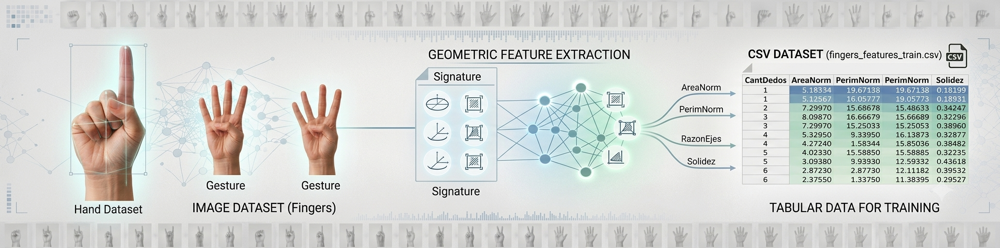

<p align="center">

</p>

# ✋📐 Dedos - Características Geométricas: Versión Tabular del Dataset de Dedos

## 1. 📖 Descripción General

**Dedos - Características Geométricas** es una versión tabular derivada del **Fingers Dataset** (Conteo de Dedos), pensada para demostrar el poder de la extracción de características frente al entrenamiento directo sobre imágenes crudas.

En lugar de utilizar los píxeles de la imagen como entrada, este dataset resume cada mano en **6 características geométricas** calculadas sobre la silueta binarizada de la mano (área, perímetro, excentricidad, solidez, extensión y razón de ejes), junto con la etiqueta de cantidad de dedos mostrados. Esto permite comparar el rendimiento de modelos simples (ej. árboles de decisión, SVM, regresión logística) entrenados sobre estas pocas variables tabulares contra modelos de visión (CNN) entrenados sobre las imágenes originales.

El dataset se generó procesando el conjunto original de imágenes en escala de grises de manos mostrando de 0 a 5 dedos, publicado en Kaggle por Pavel Koryakin (2019), a través de un pipeline de segmentación y extracción de propiedades geométricas.

## 2. 📊 Atributos y Características

### 2.1 🔑 Proceso de Extracción

Para cada imagen se aplica el siguiente pipeline:

| Paso | Operación | Propósito |
|------|-----------|-----------|
| 1 | `threshold_otsu` | Binarizar la imagen (separar mano del fondo) |
| 2 | `closing` | Cerrar pequeños huecos en la silueta |
| 3 | `clear_border` | Eliminar artefactos en los bordes |
| 4 | `regionprops` | Extraer métricas geométricas de la región |

### 2.2 🧮 Variables Generadas

| Variable | Descripción |
|----------|-------------|
| `AreaNorm` | Área de la silueta (incluyendo huecos) normalizada por eje_mayor × eje_menor |
| `PerimNorm` | Perímetro normalizado por el promedio de eje_mayor y eje_menor |
| `RazonEjes` | Razón eje_menor / eje_mayor de la elipse equivalente |
| `Excentricidad` | 0 = círculo, cercano a 1 = elipse muy alargada |
| `Solidez` | área / área convexa (qué tan irregular es el contorno) |
| `Extension` | área / área del bounding box (qué tan llena está la caja) |
| `CantDedos` | **Etiqueta**: número de dedos mostrados (0 a 5), extraída del nombre de archivo original |

Las normalizaciones de área y perímetro tienen como objetivo lograr **invariancia a la escala**: que una mano más cerca o más lejos de la cámara no altere significativamente los valores obtenidos.

## 3. 🏢 Origen y Procedencia

### 3.1 📚 Fuente Primaria

Este dataset es una transformación derivada del **Fingers Dataset** original, publicado en Kaggle por Pavel Koryakin en abril de 2019.

**URL del dataset original**:
👉 [https://www.kaggle.com/datasets/koryakinp/fingers](https://www.kaggle.com/datasets/koryakinp/fingers)

### 3.2 🏛️ Metodología de Generación

- **Origen**: imágenes en escala de grises de manos (dataset `fingers_train` / `fingers_test`)
- **Técnica**: segmentación por umbral de Otsu + extracción de propiedades geométricas (`skimage.measure.regionprops`)
- **Normalización**: escalado de valores para no depender de propiedades medidas píxeles y obtener versiones invariantes a la escala
- **Etiquetado**: la cantidad de dedos se conserva de la etiqueta original de cada imagen

## 4. 🔁 Estructura del Dataset

El dataset se distribuye en dos archivos CSV, manteniendo la misma división train/test que el dataset de imágenes original:

```
fingers_features/
├── fingers_features_train.csv   (~18.000 filas)
└── fingers_features_test.csv    (~3.600 filas)
```

Cada fila representa una imagen de mano del dataset original, resumida en sus 6 características geométricas más la etiqueta de cantidad de dedos.

### 4.1 📁 Conjunto de Entrenamiento

- **Archivo**: `fingers_features_train.csv`
- **Filas aproximadas**: ~18.000
- **Propósito**: entrenamiento de modelos de clasificación sobre variables tabulares

### 4.2 📁 Conjunto de Prueba

- **Archivo**: `fingers_features_test.csv`
- **Filas aproximadas**: ~3.600
- **Propósito**: validación y evaluación del rendimiento del modelo

## 5. 🎯 Valor Analítico y Aplicaciones

Este dataset resulta especialmente útil para:

- **Comparación de enfoques**: contrastar el rendimiento de modelos tabulares simples (árboles, SVM, regresión logística, redes neuronales pequeñas) contra CNN entrenadas sobre las imágenes originales
- **Enseñanza de extracción de características**: mostrar de forma concreta cómo un conjunto reducido de descriptores geométricos puede capturar información suficiente para clasificar
- **Proyectos con recursos limitados**: al ser un dataset tabular pequeño, es ideal para microcontroladores y dispositivos con memoria/cómputo restringido (TinyML)
- **Análisis exploratorio**: estudiar la separabilidad de clases mediante técnicas como PCA, gráficos de coordenadas paralelas o scatter plots 3D

## 6. 📝 Consideraciones Éticas

Al igual que el dataset de imágenes del cual deriva, este dataset es anónimo y no incluye información personal identificable. Aborda temas relacionados con la biometría de manos, por lo que su uso debe respetar principios éticos, tal como se indica para el dataset original.

## 7. 🔗 Acceso y Uso

### 7.1 📥 Cómo cargarlo en Python:

Acceso con el DataLoader de la biblioteca `rna` (Recomendado):
```python
# Instalar la biblioteca si no está disponible:
# !pip install https://github.com/RNA-UNIV/rna/archive/refs/heads/main.zip

from rna.data.ClassDataLoader import DataLoader

# Cargar datos tabulares en memoria
X, y, clases, _ = DataLoader.load_samples('fingers_features_train')
```

Acceso directo vía CSV:
```python
import pandas as pd

df_train = pd.read_csv('fingers_features_train.csv', index_col=0)
df_test = pd.read_csv('fingers_features_test.csv', index_col=0)

X_train = df_train.drop(columns=['CantDedos'])
y_train = df_train['CantDedos']

X_test = df_test.drop(columns=['CantDedos'])
y_test = df_test['CantDedos']

print(f"Entrenamiento: {X_train.shape}")
print(f"Prueba: {X_test.shape}")
```

## 8. 📚 Cita Recomendada

Si utilizas este dataset en tu investigación o proyecto, considera citar la fuente original:

```
Koryakin, P. (2019). Fingers Dataset. Kaggle.
https://www.kaggle.com/datasets/koryakinp/fingers
```
