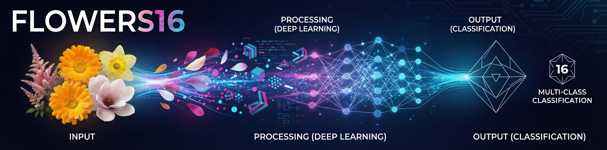

<p align="center">

</p>

# 🌸 Dataset Flowers16: Clasificación de Imágenes de Flores
## 1. 📖 Descripción General
El dataset "Flowers16" es un conjunto de imágenes de flores orientado a tareas de clasificación de imágenes, compuesto por 16 especies distintas. Su origen es la publicación de Kaggle **"🌸 | Flowers"** (`l3llff/flowers`), la cual actualmente **no se encuentra disponible** en la plataforma original.

Ante la imposibilidad de descargarlo desde Kaggle, se localizó un mirror del mismo dataset alojado en **HyperAI** ("Flower 16 Flower Classification Dataset"), a partir del cual se obtuvo el archivo `flowers16.zip` utilizado como base para esta curaduría. Cabe destacar que la documentación publicada por el mirror es parcialmente inconsistente con el contenido real del archivo: mientras HyperAI describe 14 clases con imágenes de 256×256, el ZIP descargado contenía efectivamente 16 clases y, en particular, la clase `water_lily` incluía imágenes sin normalizar, en sus resoluciones originales. Esta situación se detalla en la sección "Origen y Procedencia".

A partir de ese contenido se realizó un proceso de curaduría propio —descrito en la sección "Proceso de Curaduría"— enfocado en reprocesar la clase `water_lily` para llevarla a un formato consistente con el resto del dataset (256×256, RGB, sin imágenes de baja calidad o irrelevantes). El dataset resultante, documentado aquí, es el que queda disponible para su uso.

El dataset es adecuado para tareas de clasificación de imágenes (multi-clase, 16 especies de flores), transfer learning y ejercicios de preprocesamiento de imágenes (recorte guiado por segmentación de foreground y normalización de tamaño).

## 2. 📊 Atributos y Significados
### 2.1 🔍 Variable Objetivo
**class** (Clase / Especie): Etiqueta categórica correspondiente a la especie de flor representada en la imagen. Se determina por la carpeta contenedora de cada imagen.
- Valores: `astilbe`, `bellflower`, `black_eyed_susan`, `calendula`, `california_poppy`, `carnation`, `common_daisy`, `coreopsis`, `daffodil`, `dandelion`, `iris`, `magnolia`, `rose`, `sunflower`, `tulip`, `water_lily`
- Cantidad de clases: 16
- Uso: Clasificación (multi-clase)

### 2.2 🖼️ Atributos de la Imagen
**image** (Imagen): Archivo de imagen en formato JPEG.
- Resolución: 256×256 px (uniforme en la totalidad del dataset)
- Modo de color: mayoritariamente RGB

### 2.3 🧮 Distribución por Clase
| Clase | Imágenes |
|---|---|
| astilbe | 737 |
| bellflower | 873 |
| black_eyed_susan | 1.000 |
| calendula | 978 |
| california_poppy | 1.022 |
| carnation | 923 |
| common_daisy | 980 |
| coreopsis | 1.047 |
| daffodil | 970 |
| dandelion | 1.052 |
| iris | 1.054 |
| magnolia | 1.048 |
| rose | 999 |
| sunflower | 1.027 |
| tulip | 1.048 |
| water_lily | 890 |

- Total de imágenes: 15.648
- Mínimo por clase: 737 (astilbe) — Máximo por clase: 1.054 (iris)

## 3. 🏢 Origen y Procedencia
### 3.1 📚 Fuente Primaria: Kaggle (no disponible)
- **Publicación original**: "🌸 | Flowers" por el usuario `l3llff`
- **URL**: https://www.kaggle.com/datasets/l3llff/flowers
- **Estado actual**: dataset no disponible / eliminado del repositorio de Kaggle.

### 3.2 🔁 Fuente Secundaria (Mirror): HyperAI
- **Nombre en el mirror**: "Flower 16 Flower Classification Dataset"
- **Archivo**: `flowers16.zip` (233.73 MB)
- **URL**: https://beta.hyper.ai/en/datasets/28962
- **Descripción publicada por el mirror**: 16 tipos de flores, 13.618 imágenes de entrenamiento y 98 de verificación (carnation, iris, bellflower, goldenrod, rose, astilbe, tulip, marigold, dandelion, coreopsis, black-eyed susan, water lily, sunflower, daisy, entre otras).
- **Inconsistencia detectada**: la ficha del mirror menciona en su resumen 14 clases de imágenes de 256×256, pero el contenido real del ZIP presentaba 16 clases, y la clase `water_lily` conservaba imágenes en sus resoluciones originales (sin normalizar a 256×256), a diferencia del resto de las clases. Esto motivó el proceso de curaduría descrito en la siguiente sección.

## 4. 🔄 Proceso de Curaduría
La clase `water_lily`, única que se recibió sin normalizar, fue reprocesada con el siguiente pipeline:

1. **Segmentación de foreground**: se utilizó `rembg` con el modelo `isnet-general-use` para generar una máscara de la flor respecto del fondo de cada imagen.
2. **Recorte cuadrado centrado**: a partir del bounding box de la máscara, se agregó un margen del 15% por lado y se ajustó a un recorte cuadrado centrado en la región de interés, ajustado a los límites de la imagen original.
3. **Redimensionado**: cada recorte se llevó a 256×256 con interpolación `INTER_AREA`.
4. **Filtrado manual de calidad**: se descartaron imágenes que no resultaban adecuadas para el dataset, entre ellas:
   - Fotografías con muchas flores pequeñas en cuadro, que perdían todo detalle al reducirse a 256×256.
   - Imágenes que no mostraban la flor en sí (por ejemplo, solo una hoja flotando en el agua).
   - Imágenes demasiado artísticas o estilizadas, poco representativas de una fotografía real de la flor.
   - Al menos un caso de una imagen que no correspondía a una flor (un peluche).

Como resultado de este proceso, la clase `water_lily` pasó de 982 a **890 imágenes**, todas en 256×256.

## 5. 🎯 Valor Analítico
Este dataset resulta útil para el aprendizaje y la investigación en visión por computadora:
- Tamaño considerable (15.648 imágenes, 16 clases)
- Buen balance entre clases (relación máximo/mínimo ≈ 1.4)
- Resolución uniforme (256×256) en la totalidad del dataset, lista para su uso directo en modelos de clasificación
- Tarea principal: clasificación multi-clase; también aplicable a autoencoders, aumento de datos y transfer learning con modelos preentrenados (ImageNet)
- Caso de estudio interesante sobre curaduría de datasets de terceros: documentación de origen incompleta, necesidad de reprocesar una clase específica y criterios de filtrado manual de calidad

## 6. 📝 Consideraciones Éticas
El dataset no contiene información personal ni datos sensibles. Al tratarse de un mirror no oficial de un dataset de Kaggle actualmente no disponible, se recomienda:
- Dar crédito tanto a la publicación original de Kaggle (`l3llff/flowers`) como a la fuente del mirror (HyperAI) utilizada para su recuperación.
- Ser transparente sobre la inconsistencia de documentación detectada en el mirror, evitando presentar como definitivos datos que no pudieron confirmarse contra la fuente primaria.
- Verificar, en la medida de lo posible, la procedencia de las imágenes antes de un uso comercial, dado que el dataset original fue compilado por terceros a partir de fuentes web.

## 7. 🔗 Acceso y Uso
### 7.1 📥 Cómo cargarlo en Python:

Acceso con el DataLoader de la biblioteca `rna` (Recomendado):
```python
# Instalar la biblioteca si no está disponible:
# !pip install https://github.com/RNA-UNIV/rna/archive/refs/heads/main.zip

from rna.data.ClassDataLoader import DataLoader

# Cargar el dataset como diccionario de imágenes por clase
dataset = DataLoader.load_image_dataset('flowers16')
```

Acceso vía repositorio GitHub:
```python
import pandas as pd

# url del repositorio github para descargar
url = "https://raw.githubusercontent.com/rna-univ/datasets/main/flowers16/flowers16.zip"
# (descarga y extracción del ZIP con las carpetas por clase)
```

Acceso al mirror original (HyperAI):
```text
https://beta.hyper.ai/en/datasets/28962
```

## 8. 🔖 Cita Recomendada:
> l3llff (2022). 🌸 | Flowers Dataset. Kaggle. https://www.kaggle.com/datasets/l3llff/flowers *(dataset no disponible actualmente; mirror utilizado vía HyperAI, https://beta.hyper.ai/en/datasets/28962)*

---
*Última actualización: Julio 2026*
*Mantenido por la comunidad de ciencia de datos para propósitos educativos y de investigación.*
