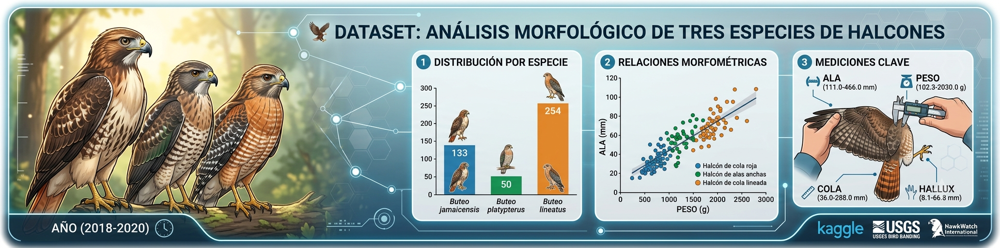

<p align="center">

</p>

# 🦅 Dataset Tres Especies de Halcones: Análisis Morfológico

## 1. 📖 Descripción General  
El conjunto de datos de Tres Especies de Halcones es un recurso valioso para el estudio de la morfometría aviar y el análisis de clasificación basado en características físicas. Este dataset documenta mediciones morfológicas detalladas de tres especies de halcones, permitiendo explorar patrones de variación entre especies y desarrollar modelos de clasificación automática. Los datos se centran en variables biométricas clave que reflejan adaptaciones ecológicas y diferencias taxonómicas.

La versión utilizada en este análisis es una traducción al español del dataset original disponible en Kaggle, manteniendo intacta la estructura y los valores, pero con los nombres de las columnas en español para facilitar su interpretación en contextos hispanohablantes.

## 2. 📊 Atributos y Significados  

### 2.1 📅 Atributo Temporal  
Año: Año en que se registró la observación o recolectó la muestra.  
`Ejemplo: 2018, 2019, 2020`

### 2.2 🦅 Variable Objetivo  
**Especie**: Especie de halcón identificada según clasificación taxonómica.  
 - `Buteo jamaicensis`: Halcón de cola roja  
 - `Buteo platypterus`: Halcón de alas anchas  
 - `Buteo lineatus`: Halcón de cola lineada  

### 2.3 📏 Atributos Morfométricos  

**Ala (Longitud del Ala)**: Longitud máxima del ala, medida desde la muñeca hasta la punta de la pluma más larga (en mm). Indicador clave del tamaño corporal y capacidad de vuelo.  
**Peso**: Masa corporal del ave al momento de la medición (en gramos).  
**Cola (Longitud de la Cola)**: Longitud total de la cola desde la inserción hasta la punta de las rectrices más largas (en mm).  
**Hallux (Longitud del Dedo del Pie)**: Longitud del dedo del pie trasero (hallux), un rasgo útil en la diferenciación de especies de rapaces (en mm).  

### 2.4 🏷️ Notas sobre los Atributos  
- Todas las mediciones son numéricas continuas, con precisión científica.  
- El atributo **Especie** es categórico y sirve como variable objetivo en tareas de clasificación.  
- Algunas mediciones pueden presentar valores nulos o atípicos debido a errores de campo o variaciones biológicas.

## 3. 🏢 Origen y Procedencia  

### 3.1 📚 Fuente Primaria: Kaggle  
El dataset base fue obtenido de la plataforma Kaggle, un repositorio ampliamente utilizado para datos científicos y de aprendizaje automático.  

> **URL Oficial**:
    👉 `https://www.kaggle.com/datasets/mathsian/three-hawk-species`
> 
>**Nombre del archivo:** `three_hawk_species.csv`

### 3.2 🏛️ Fuente Original y Contexto Científico  
Los datos originales provienen de un estudio de campo a largo plazo sobre rapaces en América del Norte, posiblemente derivados de registros de banderaje (bird banding) o investigaciones ecológicas publicadas. Aunque Kaggle actúa como repositorio, el conjunto completo y más detallado podría estar disponible a través de instituciones como:  
- North American Bird Banding Program (USGS Patuxent Wildlife Research Center)  
- Proyectos de monitoreo de aves como eBird o HawkWatch International  
- Publicaciones científicas en revistas de ornitología  

## 4. 🔄 Proceso de Curaduría  
La versión en español ha sido adaptada mediante:  
- Traducción de los nombres de las columnas al español  
- Conservación de los valores originales sin alteraciones
- Documentación clara de unidades y significado biológico  

## 5. 🎯 Valor Analítico  
Este dataset ofrece múltiples oportunidades para el aprendizaje y análisis:  
- Clasificación multiclase de especies de aves  
- Análisis estadístico de diferencias morfológicas  
- Visualización de relaciones entre variables (e.g., peso vs. longitud del ala)  
- Detección de valores atípicos y limpieza de datos  
- Imputación de datos faltantes en mediciones biométricas  
- Contexto biológico real con aplicaciones en ecología y conservación  

## 6. 📝 Consideraciones Éticas  
El uso de datos sobre especies silvestres debe respetar los protocolos éticos de investigación. Estos datos, al ser agregados y anonimizados, no comprometen individuos ni poblaciones. Su uso educativo y científico contribuye a la comprensión de la biodiversidad y debe promoverse con responsabilidad ambiental.

## 7. 🔗 Acceso y Uso  
El dataset está disponible bajo licencia abierta en Kaggle para fines educativos, de investigación y no comerciales.  

### 7.1 📥 Cómo cargarlo en Python:

Acceso vía repositorio github:
```python
import pandas as pd

# url del repositorio github para descargar
url = "https://raw.githubusercontent.com/rna-univ/datasets/main/hawks/hawks.csv"
hawks = pd.read_csv(url)

# Separar características y etiquetas
X = hawks.drop(columns=['Especie'])
y = hawks['Especie']

# Información del dataset
print("Columnas:", hawks.columns.tolist())
print("Primeras filas:\n", hawks.head())
```

## 8. 🔖 Cita Recomendada:  
> Mathsian. (2023). *Three Hawk Species Dataset*. Kaggle.  
https://www.kaggle.com/datasets/mathsian/three-hawk-species

---

*Última actualización: Abril 2024*
*Mantenido por la comunidad de ciencia de datos para propósitos educativos*