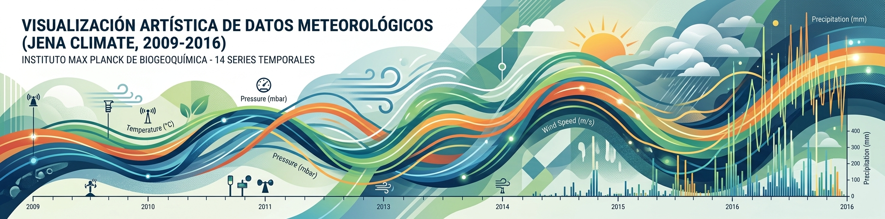

<p align="center">

</p>

# 🌦️ Dataset Jena Climate (2009–2016)

## 1. 📖 Descripción General

Este dataset corresponde a una versión preprocesada del conjunto de datos Jena Climate 2009–2016. A diferencia del dataset original, que contiene mediciones aproximadamente cada 10 minutos, esta versión presenta una frecuencia temporal uniforme de 1 hora, lo que reduce el tamaño del conjunto de datos y facilita su utilización en modelos de aprendizaje automático.

El dataset **Jena Climate** contiene registros meteorológicos obtenidos por la estación del **Max Planck Institute for Biogeochemistry**, ubicada en Jena, Alemania. Las mediciones fueron realizadas cada **10 minutos** entre enero de 2009 y diciembre de 2016, generando más de **420 mil observaciones**.

Este conjunto de datos se ha convertido en uno de los ejemplos clásicos para el estudio de **series temporales** y es utilizado frecuentemente en cursos de Deep Learning y TensorFlow para desarrollar modelos de predicción basados en redes neuronales recurrentes (RNN, LSTM, GRU), Transformers y otros modelos de forecasting.

La versión utilizada en este repositorio proviene de una copia pública del dataset original distribuida a través de Kaggle.

---

# 2. 📊 Variables del Dataset

Todas las variables corresponden a observaciones horarias obtenidas a partir del dataset original mediante un proceso de remuestreo temporal.
## 2.1 🌡 Variables Atmosféricas

**T (degC)** (Temperatura)
- Temperatura del aire en grados Celsius.
- Es la variable objetivo más utilizada en problemas de predicción.

**Tpot (K)** (Temperatura potencial)
- Temperatura potencial del aire expresada en Kelvin.

**Tdew (degC)** (Punto de rocío)
- Temperatura a la cual comienza la condensación del vapor de agua.

**rh (%)** (Humedad relativa)
- Humedad relativa del aire.

---

## 2.2 🌬 Viento

**wv (m/s)**
- Velocidad del viento.

**max. wv (m/s)**
- Velocidad máxima del viento.

**wd (deg)**
- Dirección del viento en grados.

---

## 2.3 ☁ Humedad y Vapor

**VPmax (mbar)**
- Presión máxima de vapor.

**VPact (mbar)**
- Presión real de vapor.

**VPdef (mbar)**
- Déficit de presión de vapor.

**sh (g/kg)**
- Humedad específica.

**H2OC (mmol/mol)**
- Concentración de vapor de agua.

---

## 2.4 🌍 Variables Físicas

**p (mbar)**
- Presión atmosférica.

**rho (g/m³)**
- Densidad del aire.

---

## 2.5 🕒 Tiempo

**Date Time**
- Fecha y hora de la medición.

---

# 3. 🏢 Origen y Procedencia

## 3.1 Fuente Original

Los datos fueron registrados por:

**Max Planck Institute for Biogeochemistry**
Jena, Alemania

Posteriormente fueron publicados para investigación y utilizados por TensorFlow en numerosos ejemplos oficiales sobre predicción de series temporales.

# 3.2 🔄 Preprocesamiento

El dataset fue sometido al siguiente proceso de curación:

* Conversión de la columna de fecha y hora al tipo datetime. 
* Ordenamiento cronológico de las observaciones. 
* Detección de valores faltantes. 
* Corrección de valores faltantes mediante interpolación lineal. 
* Eliminación de registros duplicados. 
* Remuestreo temporal desde una frecuencia aproximada de 10 minutos a una frecuencia uniforme de 1 hora. 
* Verificación de consistencia y ausencia de valores faltantes.

---

# 4. 🔄 Proceso de Curaduría

El dataset original fue sometido a un proceso de preprocesamiento con el objetivo de facilitar su utilización en algoritmos de aprendizaje automático. 
Las principales transformaciones realizadas fueron:

* Conversión de la columna de fecha al tipo datetime.
* Ordenamiento cronológico de las observaciones.
* Identificación de valores faltantes.
* Corrección de valores faltantes mediante interpolación lineal.
* Eliminación de registros duplicados.
* Remuestreo temporal desde aproximadamente 10 minutos a una frecuencia uniforme de 1 hora.
* Verificación de consistencia del conjunto de datos resultante.


4.1 📈 Diferencias respecto del dataset original

| Característica      | Original   | Preprocesado |
|----------------------|------------|--------------|
| Frecuencia temporal  | 10 minutos | 1 hora       |
| Registros            | 420551     | ~70000       |
| Valores faltantes    | Sí         | No           |
| Duplicados           | Posibles   | Eliminados   |
---

# 5. 🎯 Valor Analítico

Este dataset resulta especialmente interesante porque:

- posee más de 70.000 observaciones.
- contiene múltiples variables meteorológicas correlacionadas.
- presenta una resolución temporal constante (1 hora).
- permite estudiar dependencias temporales de corto y largo plazo.
- es ideal para modelos de forecasting.
- puede utilizarse para detección de anomalías y análisis exploratorio.
- tine ventajas sobre el dataset original: ausencia de valores faltantes, menor tamaño del dataset, 
frecuencia temporal uniforme y esta listo para entrenamiento sin etapas adicionales de limpieza.

Aplicaciones frecuentes:

- predicción de temperatura;
- predicción multivariable;
- forecasting de series temporales;
- detección de anomalías;
- comparación entre modelos clásicos y Deep Learning.

---

# 6. 📝 Consideraciones

El dataset no contiene información personal ni datos sensibles.

sta versión corresponde a un dataset curado. Los valores faltantes presentes en el conjunto de datos original fueron 
corregidos durante el proceso de preprocesamiento. Aunque la resolución temporal fue reducida de 10 minutos a 1 hora, 
las tendencias meteorológicas generales se preservan, haciendo que el conjunto resulte adecuado para experimentación y 
enseñanza en aprendizaje automático.

---

# 7. 🔗 Acceso y Uso

## Cargar con la biblioteca RNA

```python
from rna.data.ClassDataLoader import DataLoader

df = DataLoader.load_dataframe("jena_climate_preprocessed")
```

## Cargar desde CSV

```python
import pandas as pd

df = pd.read_csv("jena_climate_2009_2016_preprocessed.csv")

print(df.head())
```

---

# 8. 🔖 Referencia

Max Planck Institute for Biogeochemistry.

Jena Climate Dataset (2009–2016).

Utilizado en numerosos ejemplos oficiales de TensorFlow para predicción de series temporales.

La presente versión corresponde a una edición preprocesada realizada por RNA-UNIV para fines educativos y de investigación.

---

*Última actualización: Agosto 2026*

*Mantenido para fines educativos y de investigación.*