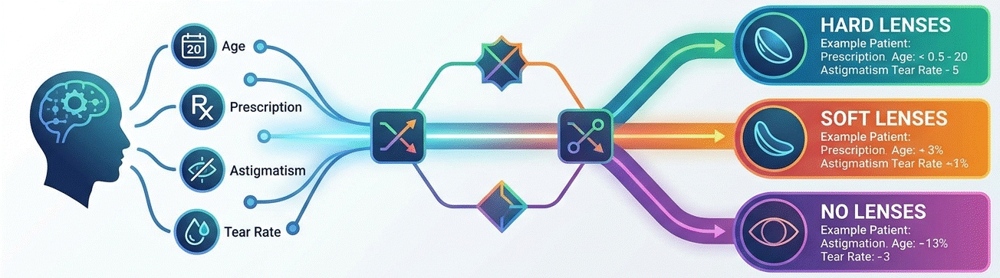

<p align="center">

</p>


# 👁️ Dataset Lenses: Prescripción de Lentes de Contacto
## 1. 📖 Descripción General
El dataset "Lenses" es un conjunto de datos clásico y didáctico ampliamente utilizado en el campo del machine learning y los sistemas expertos. Fue donado al repositorio UCI en 1990 y se basa en un problema simplificado de diagnóstico óptico: determinar qué tipo de lentes de contacto (si las hay) son adecuadas para un paciente según sus características clínicas.

> **Nota:** Los nombres de atributos y valores presentados en este documento corresponden a una traducción al español del dataset original en inglés. Los nombres originales son: `age`, `spectacle_prescription`, `astigmatic`, `tear_production_rate` y `class`, con valores como `young`, `myope`, `hypermetrope`, `reduced`, `normal`, `hard`, `soft` y `none`.

El conjunto de datos contiene 24 instancias que representan todas las combinaciones posibles de los valores de los atributos, lo que lo hace completo y sin ruido. Aunque el problema es intencionalmente simplificado y no captura todos los factores que influyen en la prescripción real de lentes de contacto, es especialmente valioso para introducir conceptos de clasificación, árboles de decisión y sistemas basados en reglas.

La versión utilizada en este análisis proviene del repositorio oficial de UCI Machine Learning Repository, una fuente confiable y ampliamente citada en investigaciones académicas y proyectos educativos.

## 2. 📊 Atributos y Significados
### 2.1 🔍 Variable Objetivo
**Diagnostico** (Tipo de lente recomendado): Indica el tipo de lente de contacto adecuado para el paciente, o si no debe usar lentes.
- `Lentes_Duros`: El paciente debe usar lentes de contacto rígidos
- `Lentes_Blandos`: El paciente debe usar lentes de contacto blandos
- `No_usar_Lentes`: El paciente no debe usar lentes de contacto

### 2.2 🔧 Atributos Clínicos del Paciente
**Edad** (Edad del paciente): Grupo etario del paciente en relación con su capacidad de acomodación visual.
- `Joven`: Paciente joven con buena capacidad de acomodación
- `pre_presb`: Paciente en etapa previa a la presbicia
- `Presbicia`: Paciente con presbicia (dificultad para enfocar objetos cercanos)

**Prescripcion** (Prescripción óptica): Tipo de defecto de refracción visual del paciente.
- `Miopía`: Dificultad para ver objetos lejanos
- `Hipermetropía`: Dificultad para ver objetos cercanos

**Astigmatismo** (Presencia de astigmatismo): Indica si el paciente presenta astigmatismo, una curvatura irregular de la córnea o el cristalino.
- `SI`: El paciente presenta astigmatismo
- `NO`: El paciente no presenta astigmatismo

**Lagrimas** (Tasa de producción lagrimal): Nivel de producción de lágrimas del paciente, factor determinante para la tolerancia al uso de lentes de contacto.
- `Normal`: Producción lagrimal adecuada
- `Reducida`: Producción lagrimal insuficiente para el uso de lentes

## 3. 🏢 Origen y Procedencia
### 3.1 📚 Fuente Primaria: UCI Machine Learning Repository
El dataset fue obtenido del repositorio oficial:
- **URL**: https://archive.ics.uci.edu/dataset/58/lenses
- **ID del dataset**: 58
- **Donado por**: J. Cendrowska (1990)

### 3.2 🏛️ Fuentes Históricas Originales
El dataset está basado en el trabajo de J. Cendrowska (1987), quien utilizó este problema como caso de estudio en el contexto de la inducción de reglas a partir de ejemplos. El problema de prescripción de lentes de contacto es un ejemplo clásico de la literatura de sistemas expertos y aprendizaje automático basado en reglas.

## 4. 🔄 Proceso de Curaduría
El repositorio UCI registra este dataset como completo y sin valores faltantes. Sus características son:
- Todas las combinaciones posibles de atributo-valor están representadas (dataset exhaustivo)
- Cada instancia es completa y correcta
- El conjunto de datos puede ser cubierto por 9 reglas
- Disponibilidad pública bajo licencia abierta

## 5. 🎯 Valor Analítico
Este dataset presenta características ideales para la introducción al aprendizaje automático:
- Tamaño mínimo y manejable (24 instancias, 4 atributos + variable objetivo)
- Todos los atributos son categóricos (sin variables numéricas)
- Sin valores faltantes (dataset limpio y completo)
- Dataset exhaustivo: cubre todas las combinaciones posibles de atributos
- Ideal para introducir árboles de decisión, sistemas de reglas y clasificación multiclase
- Contexto médico real y fácilmente interpretable

## 6. 📝 Consideraciones Éticas
Aunque este dataset no contiene información personal identificable, proviene de un contexto de diagnóstico médico simplificado. Es importante destacar que el dataset no captura todos los factores clínicos relevantes para una prescripción real de lentes de contacto, por lo que no debe utilizarse con fines médicos o diagnósticos reales. Su uso debe limitarse a propósitos educativos y de investigación en aprendizaje automático.

## 7. 🔗 Acceso y Uso
El dataset está disponible públicamente bajo una licencia **Creative Commons Attribution 4.0 International (CC BY 4.0)**, lo que permite su uso, modificación y distribución, siempre que se dé el crédito adecuado.

### 7.1 📥 Cómo cargarlo en Python:

Acceso vía UCI:
```python
from ucimlrepo import fetch_ucirepo

# fetch dataset
lenses = fetch_ucirepo(id=58)

# data (as pandas dataframes)
X = lenses.data.features
y = lenses.data.targets

# metadata
print(lenses.metadata)

# variable information
print(lenses.variables)
```

Acceso vía repositorio GitHub:
```python
import pandas as pd

# url del repositorio github para descargar
url = "https://raw.githubusercontent.com/rna-univ/datasets/main/lentes/lentes.csv"
lenses_ds = pd.read_csv(url)

# Separar características y etiquetas
X = lenses_ds.drop(columns=['Diagnostico'])
y = lenses_ds['Diagnostico']

# Información del dataset
print("Columnas:", lenses_ds.columns.tolist())
print("Primeras filas:\n", lenses_ds.head())
```

## 8. 🔖 Cita Recomendada:
>Cendrowska, J. (1987). Lenses [Dataset]. UCI Machine Learning Repository. https://doi.org/10.24432/C5K88Z

---
*Última actualización: Junio 2025*
*Mantenido por la comunidad de ciencia de datos para propósitos educativos y de investigación.*
