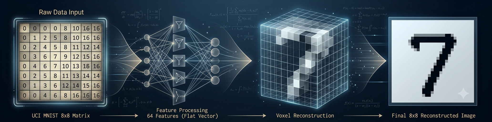

<p align="center">

</p>

# 🔢 Dataset Digits: Reconocimiento de Dígitos Manuscritos (8×8)

## 1. 📖 Descripción General

El dataset **Digits** es un conjunto de datos clásico utilizado para tareas de clasificación supervisada y reconocimiento de patrones. Contiene imágenes de dígitos manuscritos del **0 al 9**, representadas mediante imágenes en escala de grises de **8×8 píxeles**.

El dataset se distribuye en dos particiones independientes:

- Entrenamiento: 3.823 imágenes.
- Prueba: 1.797 imágenes.

En total contiene 5.620 imágenes de dígitos manuscritos correspondientes a las diez clases (0–9). Cada imagen fue convertida en un vector de 64 características, donde cada atributo representa la intensidad de un píxel.

La versión utilizada en este repositorio proviene del **UCI Machine Learning Repository**, una de las fuentes académicas más utilizadas para la enseñanza e investigación en ciencia de datos.

---

## 2. 📊 Atributos y Significados

### 2.1 🎯 Variable Objetivo

**target** (Dígito)

Representa el número manuscrito contenido en la imagen.

- Tipo: Clasificación multiclase
- Clases: 10
- Valores posibles:
  - 0
  - 1
  - 2
  - 3
  - 4
  - 5
  - 6
  - 7
  - 8
  - 9

---

### 2.2 🖼️ Variables de Entrada

Cada muestra está formada por **64 atributos numéricos**, correspondientes a la intensidad de cada píxel de una imagen de **8×8**.

Los atributos se nombran:

- pixel_0
- pixel_1
- ...
- pixel_63

Características:

- Tipo: Entero
- Rango aproximado: 0–16
- Significado:
  - 0 → píxel completamente negro
  - 16 → máxima intensidad

Los píxeles se encuentran ordenados de izquierda a derecha y de arriba hacia abajo.

---

### 2.3 🖼️ Representación de la Imagen

Cada instancia corresponde a una imagen de:

- Resolución: **8 × 8 píxeles**
- Escala de grises
- 64 características

---
### 2.4 📦 Organización del Dataset

El dataset original se encuentra dividido en dos archivos independientes:

| Archivo | Cantidad de muestras |
|---------|---------------------:|
| optdigits.tra | 3823 |
| optdigits.tes | 1797 |

Esta división permite evaluar modelos utilizando un conjunto de entrenamiento y otro de prueba previamente definidos por los autores del dataset.

---

## 3. 🏢 Origen y Procedencia

### 3.1 📚 Fuente Primaria

El dataset fue obtenido del repositorio oficial:

- **Repositorio:** UCI Machine Learning Repository
- **Dataset:** Optical Recognition of Handwritten Digits
- **URL:** https://archive.ics.uci.edu/dataset/80/optical+recognition+of+handwritten+digits

---

### 3.2 🏛️ Origen de los datos

Las imágenes fueron obtenidas a partir de formularios manuscritos y posteriormente preprocesadas para producir imágenes de **8×8 píxeles** en escala de grises, adecuadas para experimentos de reconocimiento automático de caracteres.

---

## 4. 🔄 Proceso de Curaduría

El conjunto de datos fue preparado por los autores del dataset mediante:

- Digitalización de caracteres manuscritos.
- Normalización del tamaño de las imágenes.
- Conversión a imágenes de 8×8 píxeles.
- Codificación de la intensidad de cada píxel mediante valores enteros.

El dataset no contiene valores faltantes.

---

## 5. 🎯 Valor Analítico

Este dataset posee numerosas características que lo convierten en un excelente recurso educativo:

- 5.620 imágenes en total.
- División oficial en entrenamiento (3.823) y prueba (1.797).
- 64 atributos numéricos.
- 10 clases balanceadas.
- Sin valores faltantes.
- Bajo costo computacional.
- Ideal para:
  - Clasificación multiclase.
  - Redes neuronales.
  - SVM.
  - KNN.
  - Árboles de decisión.
  - Reducción de dimensionalidad (PCA, t-SNE, UMAP).
  - Visualización de datos.

---

## 6. 📝 Consideraciones Éticas

El dataset no contiene información personal identificable ni datos sensibles. Su utilización está orientada a la enseñanza, investigación y evaluación de algoritmos de aprendizaje automático.

---

## 7. 🔗 Acceso y Uso

El dataset se encuentra disponible públicamente para fines educativos e investigación.

### 7.1 📥 Cómo cargarlo en Python

Acceso con la biblioteca `rna` (Recomendado):

```python
from rna.data.ClassDataLoader import DataLoader

df = DataLoader.load_dataframe("digits")
```

Acceso mediante Scikit-Learn:

```python
from sklearn.datasets import load_digits

digits = load_digits(as_frame=True)

X = digits.data
y = digits.target
```

Acceso desde UCI:

```python
from ucimlrepo import fetch_ucirepo

digits = fetch_ucirepo(id=80)

X = digits.data.features
y = digits.data.targets
```

---

## 8. 🔖 Cita Recomendada

> Dua, D. and Graff, C. (2019). Optical Recognition of Handwritten Digits. UCI Machine Learning Repository.

---

*Última actualización: Julio 2026*

*Mantenido por la comunidad de ciencia de datos para propósitos educativos y de investigación.*