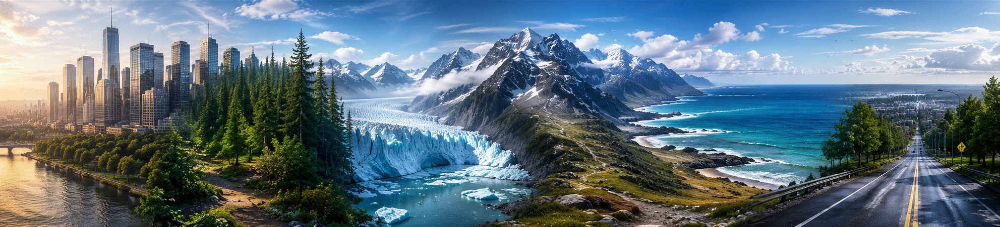

<p align="center">

</p>

# 🏔️ Dataset Natural Scenes: Clasificación de Escenas Naturales
## 1. 📖 Descripción General
El dataset "Natural Scenes" es un conjunto de imágenes del mundo real ampliamente utilizado en tareas de clasificación de escenas mediante deep learning. Fue publicado originalmente por **Intel** como parte del *Intel Scene Classification Challenge* (2018) en la plataforma Analytics Vidhya, y posteriormente distribuido en Kaggle donde alcanzó gran popularidad en la comunidad de visión por computadora.

El dataset contiene aproximadamente **17.000 imágenes** de escenas naturales y urbanas, distribuidas en **6 categorías**. Cada imagen tiene una resolución de **150×150 píxeles** en formato RGB.

Es especialmente valioso para el aprendizaje de redes neuronales convolucionales (CNNs), transfer learning y experimentación con arquitecturas de clasificación de imágenes.

Este dataset se distribuye en dos partes complementarias: **`natural_scenes_train`** (~14.000 imágenes) para entrenamiento y **`natural_scenes_test`** (~3.000 imágenes) para evaluación. Ambas partes comparten la misma estructura y etiquetas de clase. Se excluye el conjunto de predicción original (`seg_pred`) por no contar con etiquetas.

## 2. 📊 Estructura del Dataset
### 2.1 🔍 Variable Objetivo
**Clase de escena**: Etiqueta categórica que indica el tipo de escena representada en la imagen.

| Clase | Descripción |
|---|---|
| `buildings` | Edificios y construcciones urbanas |
| `forest` | Bosques y vegetación densa |
| `glacier` | Glaciares y paisajes nevados |
| `mountain` | Montañas y terrenos elevados |
| `sea` | Mar, océano y costas |
| `street` | Calles y entornos viales |

### 2.2 🖼️ Características de las Imágenes
**Formato**: JPEG  
**Resolución**: 150×150 píxeles  
**Canales**: RGB (3 canales)  
**Rango de valores**: 0–255 (uint8)

### 2.3 📁 Estructura de Carpetas
Cada parte del dataset es una carpeta independiente con las imágenes organizadas directamente por clase:

```
natural_scenes_train/       # ~14.000 imágenes de entrenamiento
├── buildings/
├── forest/
├── glacier/
├── mountain/
├── sea/
└── street/

natural_scenes_test/        # ~3.000 imágenes de test
├── buildings/
├── forest/
├── glacier/
├── mountain/
├── sea/
└── street/
```

### 2.4 📈 Distribución de Instancias
| Split | Imágenes aprox. |
|---|---|
| Entrenamiento (`seg_train`) | ~14.000 |
| Test (`seg_test`) | ~3.000 |
| **Total** | **~17.000** |

La distribución entre clases es aproximadamente balanceada en ambos splits.

## 3. 🏢 Origen y Procedencia
### 3.1 📚 Fuente Primaria
El dataset fue creado por Intel y publicado originalmente en el *Intel Scene Classification Challenge* (2018) a través de Analytics Vidhya. Está disponible públicamente en Kaggle:

- **URL**: https://www.kaggle.com/datasets/puneet6060/intel-image-classification
- **Publicado por**: Puneet Bansal (redistribución en Kaggle, 2019)
- **Origen**: Intel / Analytics Vidhya Scene Classification Challenge (2018)

### 3.2 ⚠️ Relación con Otros Datasets Derivados
Este dataset ha dado origen a variantes secundarias en Kaggle, siendo la más conocida el dataset *Landscape Image Colorization* (theblackmamba31, 2020), que toma un subconjunto de ~7.000 imágenes y genera sus pares en escala de grises para tareas de colorización. La versión documentada aquí es la **fuente original**, con mayor cantidad de imágenes, etiquetas de clase y splits definidos.

## 4. 🔄 Proceso de Curaduría
Para este repositorio se realizó la siguiente curaduría sobre el dataset original:

- Se separó el dataset en dos partes independientes: `natural_scenes_train` y `natural_scenes_test`.
- Se excluyó la carpeta `seg_pred` (~7.000 imágenes sin etiquetar), ya que no aporta valor supervisado.
- Las subcarpetas intermedias `seg_train/` y `seg_test/` fueron eliminadas; las clases quedan directamente en la raíz de cada dataset.
- Se mantuvo la estructura de subcarpetas por clase, compatible con `ImageDataGenerator` de Keras e `ImageFolder` de PyTorch.
- No se modificaron las imágenes originales (resolución, formato ni contenido).

## 5. 🎯 Valor Analítico
Este dataset presenta características ideales para el aprendizaje y la investigación en visión por computadora:

- Tamaño moderado (~17.000 imágenes), manejable sin infraestructura especializada
- 6 clases balanceadas con contenido visual diverso y bien diferenciado
- Splits de entrenamiento y test predefinidos y ampliamente validados
- Resolución uniforme (150×150), sin necesidad de redimensionamiento previo
- Compatible con frameworks estándar: TensorFlow/Keras, PyTorch, scikit-learn
- Ideal para: clasificación multiclase, transfer learning, data augmentation, visualización de features

## 6. 📝 Consideraciones Éticas
El dataset contiene únicamente imágenes de escenas naturales y urbanas sin presencia identificable de personas. No presenta sesgos conocidos relacionados con datos sensibles. Se recomienda tener en cuenta que las imágenes provienen de una recopilación de alcance global, por lo que la distribución geográfica de las escenas puede no ser uniforme.

## 7. 🔗 Acceso y Uso
El dataset está disponible públicamente en Kaggle. No se especifica una licencia explícita en la publicación original; se recomienda citar la fuente al utilizarlo en trabajos académicos.

### 7.1 📥 Cómo cargarlo en Python

Acceso vía repositorio GitHub (DataLoader):
```python
from embedia.data import DataLoader

# Ver información del dataset
DataLoader.dataset_info_display("natural_scenes_train")

# Carga completa en memoria (eager)
X_train, y_train, clases = DataLoader.load_images("natural_scenes_train", resize=(150, 150))
X_test,  y_test,  _      = DataLoader.load_images("natural_scenes_test",  resize=(150, 150))

# Carga lazy como tf.data.Dataset
ds_train, clases = DataLoader.load_images_dataset("natural_scenes_train", resize=(150, 150))
ds_test,  _      = DataLoader.load_images_dataset("natural_scenes_test",  resize=(150, 150))
```

Acceso directo con Keras:
```python
from tensorflow.keras.preprocessing.image import ImageDataGenerator

datagen = ImageDataGenerator(rescale=1./255)

train_gen = datagen.flow_from_directory(
    'natural_scenes_train',
    target_size=(150, 150),
    batch_size=32,
    class_mode='categorical'
)

test_gen = datagen.flow_from_directory(
    'natural_scenes_test',
    target_size=(150, 150),
    batch_size=32,
    class_mode='categorical'
)
```

Acceso directo con PyTorch:
```python
from torchvision import datasets, transforms

transform = transforms.Compose([
    transforms.ToTensor(),
    transforms.Normalize(mean=[0.5, 0.5, 0.5], std=[0.5, 0.5, 0.5])
])

train_ds = datasets.ImageFolder('natural_scenes_train', transform=transform)
test_ds  = datasets.ImageFolder('natural_scenes_test',  transform=transform)
```

## 8. 🔖 Cita Recomendada
> Intel. (2018). *Intel Scene Classification Challenge*. Analytics Vidhya. Disponible en Kaggle: https://www.kaggle.com/datasets/puneet6060/intel-image-classification

---
*Última actualización: Junio 2025*  
*Mantenido por la comunidad de ciencia de datos para propósitos educativos y de investigación.*
