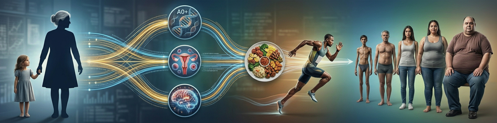

<p align="center">

</p>

# 🏃 Dataset de Obesidad: Niveles de Peso según Hábitos Alimenticios y Condición Física

## 1. 📖 Descripción General

El **Obesity Levels Dataset** es uno de los conjuntos de datos más relevantes en el ámbito de la salud pública, la nutrición y el aprendizaje automático aplicado a la medicina. Este dataset fue creado para estimar los niveles de obesidad en individuos de América Latina —específicamente de **México, Perú y Colombia**— basándose en sus hábitos alimenticios, nivel de actividad física y contexto socioconductual.

La versión utilizada en este análisis provienen del **repositorio de Machine Learning de la Universidad de California, Irvine (UCI)**, una fuente de referencia en ciencia de datos. Este conjunto de datos fue donado el **26 de agosto de 2019** por Fabio Mendoza Palechor y Alexis De la Hoz Manotas, y ha sido ampliamente utilizado en estudios de clasificación, regresión y clustering en salud poblacional.

Lo que lo hace especialmente interesante es su **combinación de datos reales y sintéticos**: aproximadamente el **23% de los registros fueron recolectados directamente mediante una plataforma web**, mientras que el **77% restante fue generado sintéticamente usando el algoritmo SMOTE en Weka**, con el fin de equilibrar las clases minoritarias y mejorar la capacidad predictiva de modelos de machine learning.

Este dataset representa un caso de estudio invaluable para comprender cómo los hábitos diarios influyen en el estado nutricional, y sirve como base para el desarrollo de intervenciones preventivas en salud.

## 2. 📊 Atributos y Significados

### 2.1  🔑 Variable Objetivo

**NObesity (Nivel de Obesidad)**: Clasificación del estado nutricional del individuo en función del índice de masa corporal (IMC) y otros factores clínicos.

- `Insufficient_Weight`: Bajo peso
- `Normal_Weight`: Peso normal
- `Overweight_Level_I`: Sobrepeso, nivel I
- `Overweight_Level_II`: Sobrepeso, nivel II
- `Obesity_Type_I`: Obesidad tipo I
- `Obesity_Type_II`: Obesidad tipo II
- `Obesity_Type_III`: Obesidad tipo III (mórbida)

### 2.2 👤 Atributos Demográficos

**Gender (Género)**: Género del individuo  
- `Male`: Masculino  
- `Female`: Femenino  

**Age (Edad)**: Edad del individuo en años. Valores numéricos (enteros o decimales).  
*Nota: Incluye rangos amplios, desde adolescentes hasta adultos mayores.*

**Height (Altura)**: Altura del individuo en metros (m).  
*Permite, junto con el peso, calcular el IMC.*

**Weight (Peso)**: Peso del individuo en kilogramos (kg).  
*Combinado con la altura, es fundamental para derivar el estado nutricional.*

### 2.3 💠 Atributos de Hábitos y Salud

**family_history_with_overweight (Antecedentes familiares de sobrepeso)**: Indica si un familiar directo tiene sobrepeso u obesidad.  
- `yes`: Sí  
- `no`: No  

**FAVC (Frecuencia de consumo de alimentos altos en calorías)**: ¿Con qué frecuencia consume comidas ricas en calorías?  
- `yes`: Alta frecuencia  
- `no`: Baja frecuencia  

**FCVC (Frecuencia de consumo de verduras)**: Escala que mide la frecuencia de consumo de vegetales.  
- `1`: Bajo  
- `2`: Moderado  
- `3`: Alto  

**NCP (Número de comidas principales por día)**: Número promedio de comidas al día.  
- `1`, `2`, `3`, `4` (valores enteros)  

**CAEC (Consumo de alimentos entre comidas)**: Frecuencia de snacks o comidas fuera de horario.  
- `Never`: Nunca  
- `Sometimes`: Algunas veces  
- `Frequently`: Frecuentemente  
- `Always`: Siempre  

**SMOKE (¿Fuma?)**: Hábito de consumo de tabaco.  
- `yes`: Sí  
- `no`: No  

### 2.4 💧 Atributos de Estilo de Vida

**CH2O (Consumo de agua diario)**: Cantidad aproximada de agua consumida al día.  
- `1`: Bajo  
- `2`: Moderado  
- `3`: Alto  

**SCC (Monitorea el consumo calórico)**: ¿Lleva control de las calorías que consume?  
- `yes`: Sí  
- `no`: No  

**FAF (Frecuencia de actividad física)**: Número de días a la semana con ejercicio físico significativo.  
- `0`: Nunca  
- `1` a `3`: Días por semana  

**TUE (Tiempo usando dispositivos tecnológicos)**: Horas diarias dedicadas a pantallas (teléfono, TV, computadora, etc.).  
- `1`: 1–2 horas  
- `2`: >2 horas  

**CALC (Consumo de alcohol)**: Frecuencia de consumo de bebidas alcohólicas.  
- `no`: Nunca  
- `Sometimes`: Algunas veces  
- `Frequently`: Frecuentemente  
- `Always`: Siempre  

**MTRANS (Medio de transporte habitual)**: Forma principal de desplazamiento.  
- `Automobile`  
- `Motorcycle`  
- `Bike`  
- `Public_Transportation`  
- `Walking`  

## 3. 🏢 Origen y Procedencia

### 3.1 📚 Fuente Primaria: UCI Machine Learning Repository 

El dataset fue obtenido del repositorio oficial de la Universidad de California, Irvine, una de las fuentes más respetadas en ciencia de datos y aprendizaje automático.

**URL Oficial**:  
👉 [https://archive.ics.uci.edu/ml/datasets/Estimation+of+obesity+levels+based+on+eating+habits+and+physical+condition](https://archive.ics.uci.edu/ml/datasets/Estimation+of+obesity+levels+based+on+eating+habits+and+physical+condition)

**Nombre del archivo**: `ObesityDataSet_raw_and_data_sinthetic.csv`

### 3.2 🏛️ Fuentes Históricas y Metodológicas

Este dataset se basa en una investigación académica publicada en **Data in Brief**, una revista científica revisada por pares. Los datos fueron recolectados de forma mixta:

- **23% datos reales**: Recabados mediante una **plataforma web** dirigida a personas de **México, Perú y Colombia**.
- **77% datos sintéticos**: Generados usando el **algoritmo SMOTE (Synthetic Minority Over-sampling Technique)** en **Weka**, para equilibrar clases poco representadas.

**Artículo original**:  
> Mendoza Palechor, F., & De la Hoz Manotas, A. (2019). *Dataset for estimation of obesity levels based on eating habits and physical condition in individuals from Colombia, Peru and Mexico*. Data in Brief, 27, 104344.  
> DOI: [https://doi.org/10.1016/j.dib.2019.104344](https://doi.org/10.1016/j.dib.2019.104344)

## 4. 🔁 Proceso de Curaduría

El equipo de UCI y los autores originales realizaron un proceso riguroso de curaduría que incluye:

- Validación cruzada de respuestas en la encuesta web
- Aplicación de SMOTE para balanceo de clases
- Codificación categórica consistente
- Eliminación de inconsistencias y outliers extremos
- Documentación detallada de cada variable
- Publicación abierta para investigación y educación

## 5. 🎯 Valor Analítico

Este dataset ofrece un entorno analítico altamente instructivo, ideal para:

- **Clasificación multiclase** (7 niveles de obesidad)
- **Análisis de factores de riesgo** (sedentarismo, dieta, genética)
- **Feature engineering** (ej: IMC, índice de actividad, dieta saludable)
- **Modelos de predicción** con Random Forest, XGBoost, redes neuronales
- **Clustering** para segmentar perfiles de estilo de vida
- **Interpretación médica** de resultados algorítmicos

Además, su mezcla de variables numéricas, ordinales y categóricas, junto con su tamaño manejable (2111 instancias, 17 atributos), lo convierte en un recurso excelente para proyectos educativos y aplicaciones reales en salud digital.

## 6. 📝 Consideraciones Éticas

Aunque el dataset es anónimo, aborda temas sensibles como peso, hábitos personales y salud mental. Su uso debe respetar principios éticos fundamentales:

- Evitar la estigmatización del sobrepeso u obesidad
- No hacer inferencias discriminatorias sobre género, clase o comportamiento
- Usar modelos para promover bienestar, no para juzgar
- Respetar el contexto cultural de los países participantes

El dataset está pensado para **fines educativos, de investigación y salud pública**, no para usos comerciales sin revisión ética.

## 7. 🔗 Acceso y Uso

El dataset está disponible bajo **licencia abierta** para investigación y enseñanza. Se recomienda citar adecuadamente tanto al repositorio UCI como al artículo original.

### 7.1 📥 Cómo cargarlo en Python:

Acceso via UCI:
```python
from ucimlrepo import fetch_ucirepo 
  
# fetch dataset 
obesity_ds = fetch_ucirepo(id=544) 
  
# data (as pandas dataframes) 
X = obesity_ds.data.features 
y = obesity_ds.data.targets 
  
# metadata 
print(obesity_ds.metadata) 
  
# variable information 
print(obesity_ds.variables) 
```

Acceso vía repositorio GitHub:
```python
import pandas as pd

# url del repositorio github para descargar
url = "https://raw.githubusercontent.com/rna-univ/datasets/main/obesity_uci/obesity_uci.csv"
obesity_ds = pd.read_csv(url)

# Separar características y etiquetas
X = obesity_ds.drop(columns=['NObesity'])
y = obesity_ds['NObesity']

# Información del dataset
print("Columnas:", obesity_ds.columns.tolist())
print("Primeras filas:\n", obesity_ds.head())
```

## 8. 🔖 Cita Recomendada:
> Mendoza Palechor, F., & De la Hoz Manotas, A. (2019). *Dataset for estimation of obesity levels based on eating habits and physical condition in individuals from Colombia, Peru and Mexico*. Data in Brief, 27, 104344.  
> Recuperado de: https://archive.ics.uci.edu/ml/datasets/Estimation+of+obesity+levels+based+on+eating+habits+and+physical+condition
