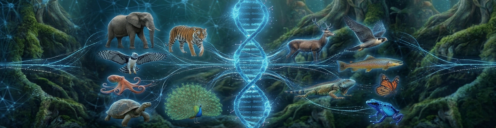

<p align="center">

</p>

# 🦁 Dataset Zoo: Clasificación de Animales mediante Características Morfológicas y Fisiológicas

## 1. 📖 Descripción General

**Zoo Dataset** es un conjunto de datos clásico en el ámbito del aprendizaje automático, ampliamente utilizado para tareas de clasificación multiclase. Este dataset describe 101 animales diferentes a través de 16 atributos binarios y uno numérico que caracterizan sus propiedades morfológicas, fisiológicas y comportamentales.

La versión incluida en este repositorio es una adaptación traducida al español del dataset original del **UCI Machine Learning Repository**, creado por Richard S. Forsyth en 1990. El dataset original ha sido utilizado durante más de tres décadas como recurso educativo fundamental en cursos de aprendizaje automático, reconocimiento de patrones y sistemas expertos.

Este dataset es especialmente valioso por su simplicidad conceptual y su capacidad para ilustrar conceptos fundamentales de clasificación, como la selección de características, el sobreajuste, y la interpretabilidad de modelos. Los animales están clasificados en 7 categorías taxonómicas basadas en sus características compartidas, permitiendo explorar tanto la clasificación supervisada como el análisis de agrupamiento.

## 2. 📊 Atributos y Significados

El dataset contiene 17 columnas más un identificador (nombre del animal). Los atributos representan características observables de los animales, codificadas principalmente como valores binarios (0 = No, 1 = Sí).

### 2.1 🔑 Atributos Predictores

**Características Morfológicas:**
- **Tiene_Pelo**: Indica si el animal posee pelo o pelaje (1 = Sí, 0 = No)
- **Tiene_Plumas**: Indica si el animal posee plumas (1 = Sí, 0 = No)
- **Tiene_Aletas**: Indica si el animal posee aletas (1 = Sí, 0 = No)
- **Tiene_Cola**: Indica si el animal posee cola visible (1 = Sí, 0 = No)
- **Cant_Patas**: Número de patas del animal (valores: 0, 2, 4, 5, 6, 8)

**Características Reproductivas:**
- **Nace_de_huevo**: Indica si el animal es ovíparo (1 = Sí, 0 = No)
- **Toma_Leche**: Indica si el animal es mamífero y amamanta crías (1 = Sí, 0 = No)

**Características Fisiológicas:**
- **Respira**: Indica si el animal respira aire (pulmones) (1 = Sí, 0 = No)
- **Venenoso**: Indica si el animal es venenoso o ponzoñoso (1 = Sí, 0 = No)
- **Dentado**: Indica si el animal posee dientes (1 = Sí, 0 = No)
- **Vertebrado**: Indica si el animal posee columna vertebral (1 = Sí, 0 = No)

**Características de Locomoción:**
- **Vuela**: Indica si el animal es capaz de volar (1 = Sí, 0 = No)
- **Acuatico**: Indica si el animal vive en ambientes acuáticos (1 = Sí, 0 = No)

**Características Comportamentales:**
- **Depredador**: Indica si el animal es carnívoro o cazador (1 = Sí, 0 = No)

**Características Antropocéntricas:**
- **Domestico**: Indica si el animal es comúnmente domesticado (1 = Sí, 0 = No)
- **Tamano_Gato**: Indica si el animal es aproximadamente del tamaño de un gato doméstico o más pequeño (1 = Sí, 0 = No)

### 2.2 🎯 Variable Objetivo

**Clase**: Categoría taxonómica del animal. El dataset clasifica los animales en 7 tipos principales:

1. **Mamifero**: Animales vertebrados con pelo, que amamantan a sus crías (41 instancias)
   - Ejemplos: oso, perro, gato, delfín, murciélago
   
2. **Ave**: Animales vertebrados con plumas, que nacen de huevos (20 instancias)
   - Ejemplos: cuervo, pingüino, avestruz, paloma
   
3. **Reptil**: Animales vertebrados de sangre fría, generalmente con escamas (5 instancias)
   - Ejemplos: víbora, tortuga, tuatara
   
4. **Pez**: Animales vertebrados acuáticos con aletas y branquias (13 instancias)
   - Ejemplos: atún, robalo, carpa, pez gato
   
5. **Anfibio**: Animales vertebrados que viven tanto en agua como en tierra (4 instancias)
   - Ejemplos: rana, sapo, tritón
   
6. **Insecto**: Animales invertebrados con exoesqueleto y 6 patas (8 instancias)
   - Ejemplos: abeja, mosca, polilla, avispa
   
7. **Invertebrado**: Otros animales sin columna vertebral (10 instancias)
   - Ejemplos: pulpo, cangrejo, almeja, gusano

### 2.3 📝 Identificador

**animal**: Nombre común del animal en español (texto). Este campo es un identificador único para cada instancia y no debe utilizarse como característica predictora en modelos de clasificación.

## 3. 🏢 Origen y Procedencia

### 3.1 📚 Fuente Primaria

El dataset original fue donado por Richard S. Forsyth al **UCI Machine Learning Repository** en 1990 y ha sido mantenido por la Universidad de California, Irvine durante más de 30 años.

**URL del Dataset Original**:  
👉 [https://archive.ics.uci.edu/dataset/111/zoo](https://archive.ics.uci.edu/dataset/111/zoo)

**Licencia**: Creative Commons Attribution 4.0 International (CC BY 4.0)

### 3.2 🏛️ Metodología de Construcción

El dataset fue construido manualmente por expertos en zoología:
- **Tipo de datos**: Características binarias y categóricas derivadas de conocimiento biológico establecido
- **Proceso de etiquetado**: Clasificación taxonómica basada en criterios científicos estándar
- **Validación**: Las características fueron verificadas contra referencias zoológicas
- **Particularidades**: El dataset contiene 17 variables, la mayoría lógicas, que indican si el animal correspondiente tiene o no la característica correspondiente

**Creador Original**:  
Forsyth, R. (1990). *Zoo Dataset*. UCI Machine Learning Repository.

### 3.3 🌍 Versión en Español

Esta versión incluye:
- Traducción de nombres de columnas al español
- Traducción de nombres de animales comunes
- Traducción de las categorías de clase
- Preservación de la estructura y valores originales del dataset

## 4. 🔁 Estructura del Dataset

El dataset está contenido en un único archivo CSV con la siguiente estructura:

```
zoo.csv
├── 101 filas (animales)
├── 18 columnas (1 identificador + 16 características + 1 clase)
└── Sin valores faltantes
```

### 4.1 📁 Formato del Archivo

- **Formato**: CSV (Comma-Separated Values)
- **Codificación**: UTF-8
- **Separador**: Coma (,)
- **Encabezado**: Primera fila contiene nombres de columnas
- **Valores faltantes**: Ninguno (dataset completo)
- **Filas duplicadas**: 1 instancia duplicada ("rana" aparece dos veces con características ligeramente diferentes)

### 4.2 📊 Distribución de Clases

La distribución de animales por clase es desbalanceada:

| Clase | Cantidad | Porcentaje |
|-------|----------|------------|
| Mamifero | 41 | 40.6% |
| Ave | 20 | 19.8% |
| Pez | 13 | 12.9% |
| Invertebrado | 10 | 9.9% |
| Insecto | 8 | 7.9% |
| Reptil | 5 | 5.0% |
| Anfibio | 4 | 4.0% |

Este desbalanceo es importante considerarlo al entrenar modelos de clasificación, especialmente para las clases minoritarias.

## 5. 🎯 Valor Analítico

Este dataset ofrece un entorno de aprendizaje ideal para:

- **Clasificación multiclase**: 7 clases con características discriminativas claras
- **Selección de características**: Identificar qué atributos son más relevantes para cada clase
- **Árboles de decisión**: El dataset es especialmente adecuado para visualizar reglas de clasificación
- **Interpretabilidad**: Las características son comprensibles y las reglas de clasificación son explicables
- **Manejo de desbalanceo**: Práctica con clases minoritarias
- **Sistemas expertos**: Construcción de reglas lógicas basadas en conocimiento del dominio
- **Análisis exploratorio**: Dataset pequeño ideal para visualización y comprensión manual
- **Proyectos educativos**: Tamaño manejable para cursos introductorios de machine learning

El tamaño moderado del dataset (101 instancias) lo hace especialmente adecuado para proyectos académicos y aprendizaje de conceptos fundamentales.

## 6. 📝 Consideraciones Éticas

### 6.1 ⚠️ Limitaciones del Dataset

- **Tamaño reducido**: Solo 101 instancias pueden llevar a sobreajuste en modelos complejos
- **Simplificación biológica**: Las categorías son simplificaciones de taxonomías científicas más complejas
- **Sesgo de selección**: Los animales seleccionados no son una muestra representativa de toda la biodiversidad mundial
- **Características binarias**: La realidad biológica es más continua y matizada que las variables binarias sugieren
- **Taxonomía desactualizada**: La clasificación de 1990 puede no reflejar avances taxonómicos recientes

### 6.2 🌍 Consideraciones de Uso

Este dataset es puramente educativo y no debe usarse para aplicaciones de conservación, gestión de biodiversidad o clasificación zoológica real. Las simplificaciones del dataset no capturan la complejidad de los sistemas biológicos reales.

## 7. 🔗 Acceso y Uso

### 7.1 📥 Cómo Cargarlo en Python

Acceso con el DataLoader de la biblioteca `rna` (Recomendado):
```python
# Instalar la biblioteca si no está disponible:
# !pip install https://github.com/RNA-UNIV/rna/archive/refs/heads/main.zip

from rna.data.ClassDataLoader import DataLoader

# Cargar el dataset como DataFrame de Pandas
df = DataLoader.load_dataframe('zoo')
```

**Acceso vía GitHub:**
```python
import pandas as pd

# Cargar desde URL del repositorio
url = 'https://raw.githubusercontent.com/rna-univ/datasets/main/zoo/zoo.csv'
zoo_ds = pd.read_csv(url)

# Separar características y etiquetas
X = zoo_ds.drop(columns=['animal', 'Clase'])
y = zoo_ds['Clase']

# Información del dataset
print("Columnas:", zoo_ds.columns.tolist())
print("Dimensiones:", zoo_ds.shape)
print("\nPrimeras filas:\n", zoo_ds.head())
print("\nDistribución de clases:\n", y.value_counts())
```

**Acceso vía UCI Machine Learning Repository (versión original en inglés):**
```python
import pandas as pd

# Cargar dataset original desde UCI
url = 'https://archive.ics.uci.edu/ml/machine-learning-databases/zoo/zoo.data'

# Definir nombres de columnas manualmente (el archivo no tiene encabezado)
column_names = [
    'animal_name', 'hair', 'feathers', 'eggs', 'milk', 'airborne',
    'aquatic', 'predator', 'toothed', 'backbone', 'breathes', 'venomous',
    'fins', 'legs', 'tail', 'domestic', 'catsize', 'class_type'
]

zoo_uci = pd.read_csv(url, names=column_names)

print("Dataset UCI Zoo (versión original):")
print(zoo_uci.head())
```

**Vía archivo local:**
```python
import pandas as pd

# Cargar desde archivo descargado
zoo_ds = pd.read_csv('zoo.csv')

# Exploración básica
print(f"Número de animales: {len(zoo_ds)}")
print(f"Número de características: {len(zoo_ds.columns) - 2}")  # Excluyendo 'animal' y 'Clase'
print(f"Clases únicas: {zoo_ds['Clase'].unique()}")

# Verificar valores faltantes
print("\nValores faltantes:", zoo_ds.isnull().sum().sum())
```

## 8. 📚 Cita Recomendada:

Si utilizas este dataset en tu investigación o proyecto, cita la fuente original:

```
Forsyth, R. (1990). Zoo [Dataset]. UCI Machine Learning Repository. 
https://doi.org/10.24432/C5R59V
```


